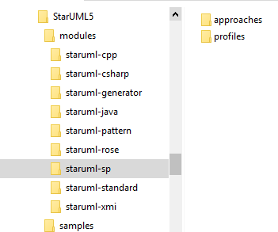
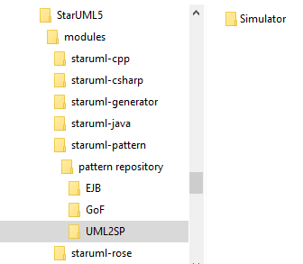

This folder contents UML2 SP implementation for [StarUML ver. 5.0 (for Windows)](http://staruml.sourceforge.net/v1/about.php).  
StarUML - The Open Source UML/MDA Platform StarUML is an open source project to develop fast, flexible, extensible, featureful, and freely-available. UML/MDA platform running on Win32 platform. The StarUML is free UML editor.

# UML2 SP install

1. Install [StarUML ver. 5.0](https://sourceforge.net/projects/staruml/files/staruml/5.0/). See [StarUML 5.0 Documentations](http://staruml.sourceforge.net/v1/documentations.php) or find on GitHub. 
2. Download a copy of the `staruml-sp.zip` in, unzip and place it in the following folder: 
`\StarUML5\modules\staruml-sp` 

 
3. Download a copy of the `uml2sp-pattern.zip` in, unzip and place it in the following folder: 
`\StarUML5\modules\staruml-pattern\pattern repository` 

 
4. Run StarUML and create new project with UML2 SP Approach   

# UML2 SP Release
See [this](release.md)
