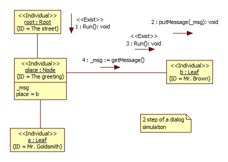

# A brief overview of the UML SP
See also [Gurianov V.I. A Brief Overview of the UML Scientific Profile](https://arxiv.org/abs/2104.10042), arXiv:2104.10042 (cs.DC), 2021
## 1. About UML2 SP
UML 2 SP is an abbreviation for UML 2 Scientific Profile and designed for the development of simulation models.  

A simulation include follow steps:
1. define goals of modeling and requirements to simulator
2. conceptual modeling
3. formal describe
4. programming
5. verification and validation
6. make general plan of experiments
7. make up tactical plan and execute experiment
8. analyze results of experiments

UML2 SP support three first step. This Unified Process (UP)  modification is called SSP (Simulation with Scientific Profile).

## 2. Simple example
Consider the following simple situation.  
Problem domain: Greeting  
-- Mr. Goldsmith : Good morning. How are you?.  
-- Mr. Brown: Not bad, thank you /Thanks, not so well.  
It's necessary create a simulation model of dialog.

Conceptual modeling  
As a rule, a scientific models is depicted as an ontologies.
In our opinion, frame semantic networks can be used to describe scientific models along with mathematical models.  

In UML2 SP conceptual model is an ontology.

Class diagram is:  

  
Figure 1 - The ontology of the situation

**Problem domain semantics.**  
Further we use the terms of knowledge engineering.  
A "Component" frame define concept "Subject" . This frame has "name" and "next" slots. 
A "Leaf" frame  define concept "Human". 
A "Composite" frame define concept "Dialog space" and has "pl" slot. 
A "Root" frame define concept "Environment". It is initial and boundary conditions. 
A "Node" frame define concept "Greeting" and has "msg" slot. It is the system under study. 
Class operations define a rule of change of slot. 

**Computational semantics.**
Ontologies described in UML SP can be attributed to the class of executable ontologies, because the model can be immediately translated into one of the programming languages.  
With view of computational semantic, the class diagram is variant of a *Composite* pattern by GoF.

As a rule, ontology alone is not enough to describe a model. For example, it is required to define the operations algorithm in some detail.  
Class operations define rules for changing slots and define a concepts. A critical meaning is given to the operations of the «Exist» stereotype. These operations determine the course of model time.  
One may use communication diagrams for this purpose, Figure 2. The communication diagram is an instance of the Class diagram:  

   
 Figure 2 - Step 1

- Mr. Goldsmith : Good morning. How are you?.  
- Mr. Brown: Not bad, thank you /Thanks, not so well.  

 The dialog includes the following events.
 1. Activation of the object pl from the context
 2. Mr. Goldsmith sees Mr. Brown
 3. Mr. Goldsmith is processing this message
 4. Mr. Goldsmith sends the message "Good morning. How are you?"
 5. The list of *place* will be shifted by one position, i.e. from a to b

    
 Figure 3 - Step 2
 
 2. Reactivation of the object *place* from the context
 3. The message "Good morning. How are you?" is received by Mr. brown.
 4. Mr. Brown is processing the message  
 5. Mr. Brown sends the message "Not bad, thank you"  

 
The simulation model in C++ code: [main.cpp](https://github.com/vgurianov/uml-sp/blob/master/examples/SimpleExample/main.cpp) 

[View on GitHub](https://github.com/vgurianov/uml-sp/tree/master/examples/SimpleExample)
