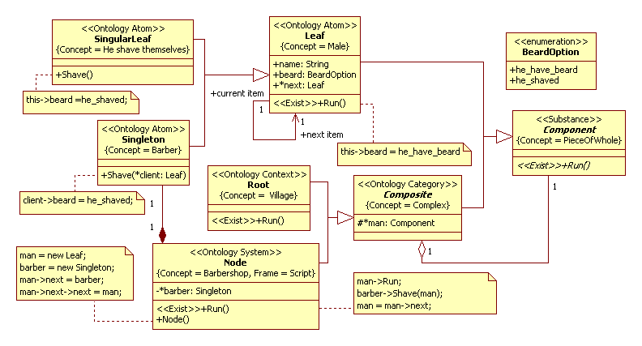

# Paradox of barber by Bertrand Russell
Barber paradox view on [Wikipedia](https://en.wikipedia.org/wiki/Barber_paradox)
## Application domain
Remind, the barber is the "one who shaves all those, and those only, who do not shave themselves." The question is, does the barber shave himself? The queue is the sequence of village males to the barber.  

A class diagram from an Analysis Model depicted in Figure 1 

 
Figure 1: An object-oriented simulation model of a queue to the barber

## Description of a computational semantics
It is example correct define type of data.
## Description of an application domain semantics
- A general structure of model defines the Composite pattern. A Root class set the boundary and initial conditions. The «Exist» methods define a unit of discrete time. In the class diagram we allow superfluity for most clarity. In particular, we do not use SPSlot stereotype. Also, we simplify the class diagram and omit classes with "EScene" and "ETool" stereotypes. It is a model of the measuring instrument. 
- The proposed solution will be as follows. The queue simulate as a linked list comprising of an instances of Leaf class. The list is a circular (loop) list. The barber serve client and the list shift on one item (Run() method of Node class). In case Figure 1 the barber can be insert in this list (see Node() constructor). If paradox is exist then shall been has error of program. For proposed solution Fig.1 is has not error.

## The simulation model in C++ code:  
[baseClassOfBarberParadox.h](https://github.com/vgurianov/uml-sp/blob/master/examples/barber_paradox/ClassesOFBarberParadoxProject.h), [baseClassOfBarberParadox.cpp](https://github.com/vgurianov/uml-sp/blob/master/examples/barber_paradox/ClassesOFBarberParadoxProject.cpp)

## References
