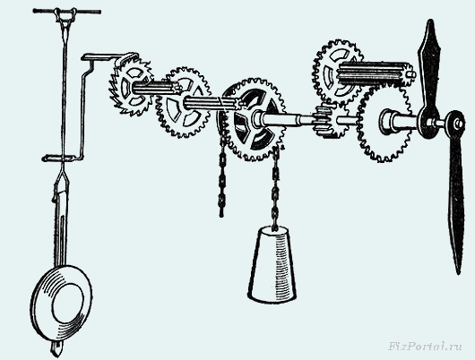
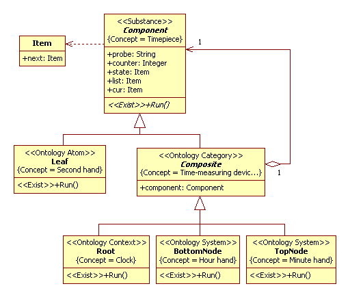
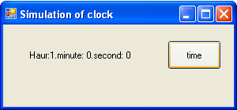
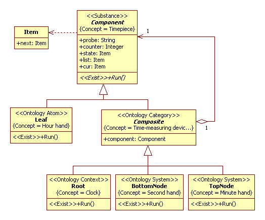
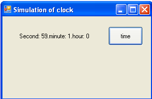

# Decomposition of clock
Terms view on [Wikipedia](https://en.wikipedia.org/wiki/Pendulum_clock).
## Introduction
The SSP (Simulation with Scientific Profile) is analog of Unified Process to development a simulation models. The main principle of the SSP is a decomposition principle [1]. First of all, we define context and system. Farther, we make decomposition of system to subsystems. In the end, we have atomic objects. The atomic object is an anolog of ABS-agent. For decomposition, we use *Composite* pattern.<br/>
In the SSP, the particularity feature of decomposition is a decomposition of time. For any subsystem need to define a minimal change of subsystem (quantum of exist, can say ). In the UML2 SP, it is a operation with "Exist" stereotype. In this section we will discurse it topic.

## Encapsulate of time
In nature, often different processes have different scale of time. For instance, the time of the turn of the Earth around the axis is small in comparison with the time of turn of the Earth around of the Sun. You can approximately take a day as event, ie for a point. This is very similar to the definition of a point particle. This is simulated in that one procedure is called from another procedure. From the point of view of the first procedure, the process of the second procedure will be an event. We can say that the second procedure encapsulates the time of the second process.<br/>
Encapsulate of time is called Tempo-world. [Sergei P. Kurdyumov](https://en.wikipedia.org/wiki/Sergei_P._Kurdyumov) proposed this term [2].<br/>
We will view example of a time decomposition.

## Application domain
In the pendulum clock, the work of a constant external force (gravity acting on the weight) periodically compensates for the loss of mechanical energy of the pendulum. For details, see [Wikipedia](https://en.wikipedia.org/wiki/Pendulum_clock).
<p></p>
Figure 1. Pendulum clock (picture from [http://fizportal.ru/](http://fizportal.ru/physics-book-67-3))<br/>

First of all, we are interested in a gear train.
The gear ratios of the gear train divide the rotation rate down to give wheels that rotate once every hour and once every 12 hours, to turn the hands of the clock.<br/> 
Where are two objects such that their time is sinhronize. First object is the hour hand (and dial), second object is the minute hand (and dial). 

## Analysis model
Also consider seconds hand. Let the seconds hand by directly connected with the pendulum.
A conceptual model in UML2 SP is an analysis class diagram. This diagram considered as ontology. 
Model the clock is depicted in Fig.2.

<p></p>
Figure 2. The class diagram<br/>

The ontology consist as frames and links between them. Frames define concepts: Timepiece, Time-measure device, Second hand, Minute hand, Hour hand, and Clock. The *Item* class do not a frame, it is definition of type for attributes of *Component* class.<br/>
The *Root, BottomNode, TopNode, Leaf* instances are nested inside each other (see aggregate association). Time of these objects also  nested inside each other. Decomposition of time is the following.<br/>
The *«Exist»Run()* operation of *BottomNode* class (in C#) is 
```
public override void Run()
{
   this.component.Run();
   if (cur == null) { cur = list; counter = 0; };
   probe = "Haur:"+counter.ToString() + this.component.probe;
   cur = cur.next; counter++;
} ,
```
where *component* variable is *TopNode* type.<br/>
The *«Exist»Run()* operation of *TopNode* class is
```
public override void Run()
        {
            cur = list;
            while (cur != null)
            {
                cur = cur.next; counter++;
                this.component.Run();
            }
            cur = list; counter = 0;
            probe = ".minute: " + counter.ToString() + this.component.probe;
        }
```
where *component* variable is *Leaf* type.<br/>
The *«Exist»Run()* operation of *Leaf* class  is a similar code.<br/>
For observer of *BottomNode*, process *«Exist»Run()* of *TopNode* is an event and *this.component.probe* variable will show 0 minutes because 60-minutes cycle is the end. For observer of *TopNode*, process *«Exist»Run()* of *Leaf* is an event and *this.component.probe* variable will show 0 seconds because 60-seconds cycle is the end.

### Verification
<p></p>
Figure 3. Results of observe the simulation model<br/>

### The simulation model in C# code:  
[ClockClass.cs](https://github.com/vgurianov/uml-sp/blob/master/examples/clock/ClockClass.cs) 

## Alternative model of analysis 
Let the *Researcher* be located in an atomic object. In this case, the model is changes. 
Model the clockk is depicted in Fig.4.

<p></p>
Figure 4. The alternative class diagram<br/>

The atomic object becomes a context object, and the context object becomes an atomic object. Now the *Researcher* can observe all the processes, but both *TopNode* and *Leaf* processes will go very slowly.

### Verification
<p></p>
Figure 5. Results of observe the simulation model<br/>

### The simulation model in C# code:  
[ClockClassAlt.cs](https://github.com/vgurianov/uml-sp/blob/master/examples/clock/ClockClassAlt.cs)

## Conclusion
The main principle of the SSP is a decomposition principle. The particularity feature of decomposition is a decomposition of time. For any subsystem need to define a minimal change of subsystem. It is a operation with "Exist" stereotype.<br/>

## References
1.	[V.I. Gurianov, Simulation with UML SP. Cheboksary: SPbSEU, branch in Cheboksary, 2014. - 136 p.(In Russian)](http://simulation.su/static/en-books.html)
2. S.P. Kurdyumov, H.N. Knyazeva, Foundations of Synergetics: Blow-up Regimes, Self-organization, Tempo-worlds, Saint-Petersburg: Aletheia, 2002 
