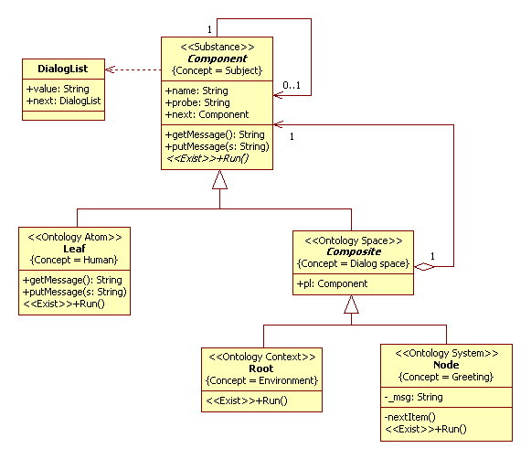
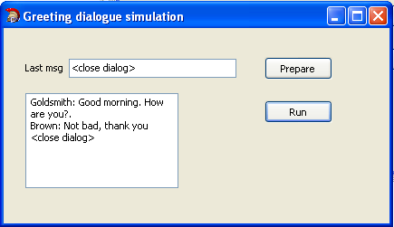

<h1 id="dialogs">Dialogs</h1>  
Terms view on [Wikipedia](https://en.wikipedia.org/wiki/Dialogue).
## Introduction
The base element of UML2 SP model is elementary act of communication.A model of elementary act of communication was presented to book [1]. The [communication process](https://en.wikipedia.org/wiki/Models_of_communication) consist a set of elementary acts of communication that linked between them. The simplest communication process is a dialog; therefore, its study is of great interest. Dialog is like atom of hydrogen in physical theory.<br/>
In this example we shall simulated dialogs between humans.<br/>

## Problem domain
[Dialogue](https://en.wikipedia.org/wiki/Dialogue) is a written or spoken conversational exchange between two or more people. Dialogue is a process of mutual communication. There is a constant change in the roles of "listening-speaking".
Replicas of dialogue are speech acts.<br/>
A typical set of parts of a conversation is given below.

Establishment of contact with the interlocutor (visual and speech). Common phrases: "Hello", "Long time no see", "Sorry", etc.
1. Start of conversation
Greeting.<br/>
The question of whether the conversation is possible: "I'm not tearing you away?", "Can you talk now?", "Excuse me, can I ask you?", "Are you currently not engaged?".<br/>
Questions about life, affairs, health (usually in an informal friendly conversation).<br/>
Message about the purpose of the conversation.<br/>
2. Development of the topic.
The speaker sends information and gets reaction of the interlocutor, his response cues. 
3. The end of the conversation.
Final phrases accompanying the end of the conversation (are of a general nature). Etiquette phrases accompanying the end of any conversation.<br/>
Parting.

For example, greeting short dialog is<br/>  
– Good morning, Mr. Goldsmith. It’s been a long time since we met. How nice to see you again.<br/>
– How do you do, Mr. Brown. I’m glad to see you too. How are you?<br/>
– Not bad, thank you /Thanks, not so well.<br/>

## Analysis model
In UML2 SP, a conceptual model is an ontology, which draw as an analysis class diagram. Model of the dialog is depicted in Fig.1.<br>
<p></p><br>
Figure 1. The class diagram for the dialog model<br>

<p>Formal describe this definition is a ontology depicted in class diagram.<br /></p>

### Description of a computational semantics
All objects of class have parallel threads.

### Description of an application domain semantics
We shall give definition of concepts to the ontology.

#### Subject
The “Component” frame define “Subject” concept. A subject is an entity that has a relationship with another entity. The subject can be is a human or a group of human. The frame has “next” slots. The slot define “receiver” concept. The receiver is a "listening" subject. 
The frame has *getMessage()* and *putMessage()* operation. It operations define "Send message" and "Receive message" concepts.


#### Human
The “Leaf” frame define “Human” concept. Human is an interlocutor, participant of conversation.

#### Dialog space
The “Composite” frame define “Dialog space” concept and has “pl” slot.

#### Greeting dialogue
The “Node” frame define “Greeting dialogue” concept and has “msg” slot. It is the system under study.<br>
The *Run()* operation organize  exchange of replicas. The algorithm of *Run()* operation is depicte in Fig.3.<br>
<p></p><br>
Figure 2. The algorithm of Run() operation<br>

#### Environment
The “Root” frame define “Environment” concept . It is initial and boundary conditions.

## Verification
For verification, we shall consider simplest set of replicas:
```
  memory = new DialogList;
	cm = memory;
	cm->value = "Good morning. How are you?.";
	cm->next = new DialogList;
	cm->next->value = "Not bad, thank you";
	cm = memory;
  ```
The result of observation to simulation model is shown on Fig. 3.<br>
<p></p><br>
Figure 3. Results of observation to simulation model<br>


## The simulation model in C++ code:  
[ClassesOfDialogProject.h](https://github.com/vgurianov/uml-sp/blob/master/examples/dialogs/ClassesOfDialogProject.h), 
[ClassesOfDialogProject.cpp](https://github.com/vgurianov/uml-sp/blob/master/examples/dialogs/ClassesOfDialogProject.cpp)

## Conclusion
In this section considered object model of the dialogues. 

## References
1.	[V.I. Gurianov, Simulation with UML SP. Cheboksary: SPbSEU, branch in Cheboksary, 2014. - 136 p.(In Russian)](http://simulation.su/static/en-books.html)
