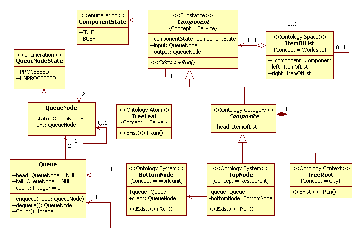
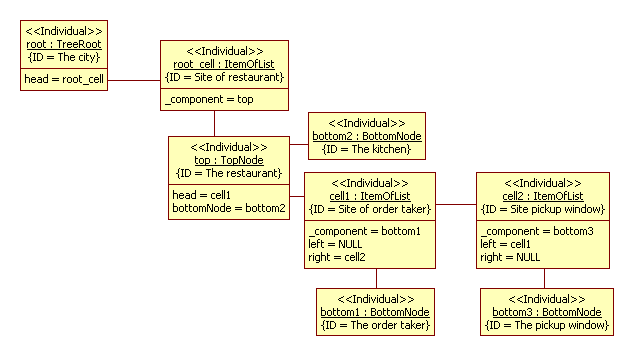

# Simulation model of a fast food restaurant
That model good known and described as an example [1].

## Application domain
We consider a simplified variant of simulation model of a fast food restaurant from [1]. 
When a car enters from the street, the driver decides to get in line or not. 
If the driver decides to leaves the restaurant then he leaves as a dissatisfied customer. 
If the driver decides to get in line, then he waits until the menu board is available. 
At that time, the driver makes the order to the order taker.
After the order taken, then the driver moves forward and the next customer can order. It is a first activity. 
The order sends to the kitchen. As soon as kitchen is available, order takes the cook. It is a second activity.
As soon as customer arrived to the pickup window, he pays and picks up his food. 
As soon as he picks up his food, then the customer leaves the restaurant as satisfied customer.
	
A conceptual model in UML2 SP is an analysis class diagram. This diagram considered as ontology. 
The analysis class diagram of fast food restaurant model depicted in Fig.1.

Figure 1. Analysis class diagram of the fast food restaurant

## Description of a computational semantics
The object of TopNode class and the objects of TreeLeaf and BottomNode classes interact according Producer-Consumer pattern [2]. The Producer-Consumer pattern is standard solution for interaction two and more threads.
## Description of an application domain semantics
An ontology accurately define the application domain for the fast food restaurant. 
### Service
The “Component” frame defines Service concept (notion). Service is a server or a queuing system. It is a general notion for a queuing systems. The frame has “input” and “output” slots. Those attributes has type “QueueNode”. It is defined of “Request” concept. The “QueueNode” class is not a frame, it is a type.
The frame has “componentState” slot. It is state of a queuing entity.
### Server
The “TreeLeaf” frame defines Server concept. The Run method is realization abstract operation Run. This operation defines a rule of change of slots value. There are three instance of server. It is the Order Taker, Kitchen and Order Pickup Window.
### Workplace
The “ItemOfList” frame defines Workplace concept. Workplace is a space for a server or a queue system (see 'component' slot). Any workplace linked to other workplace (see 'left' and 'right' slots). This element is a building block for a configuration space of system.
### OneAndTwo-server queue system
The “Composite” frame defines OneAndTwo-server queue system concept. The Ontology Category stereotype defines a category (group) of a queuing system. The restaurant is three-server queue system. A configuration space defines a category of a queuing system. We suggest configuration space with allocated server. It is Kitchen server. This configuration space depicted in Fig.2.

Figure 2. A configuration space of the restaurant

### Restaurant
The “TopNode” frame defines Restaurant concept. It is a queuing system consist three queuing. A every  server have one queue. The Order Pickup Window server have one queue, i.e. order from kitchen immediately pick up. The frame has “Queue” slot. It is define “Order queue to kitchen” concept. A type of the slot is Queue. The frame has “bottomNode” slot. This slot defines “Kitchen” concept.
### Work Unit
The “BottomNode” frame defines Work Unit concept. Work unit is a middle level of structure of restaurant. The frame has “Queue” slot. It is define “Customer queue” concept. The frame has “Client” slot. It is defines “Customer” concept.

### Calling population
The “TreeRoot” frame defines Calling population concept. It is a population of potential customers. This set may be finite or infinite. The concept set a boundary and initial condition for the queuing system.
  
### The simulation model in C++ code:  
[baseClassOfFastFoodProject.h](https://github.com/vgurianov/uml-sp/blob/master/examples/fast_food/baseClassOfFastFoodProject.h), [baseClassOfFastFoodProject.cpp](https://github.com/vgurianov/uml-sp/blob/master/examples/queue/baseClassOfFastFoodProject.cpp)

## References

1. Ricki G. Ingalls, INTRODUCTION TO SIMULATION, *Proceedings of the 2013 Winter Simulation Conference, R. Pasupathy, S.-H. Kim, A. Tolk, R. Hill, and M. E. Kuhl, eds*
2. Mark Grand, Patterns in Java, Volume 1: A Catalog of Reusable Design Patterns Illustrated with UML, Second Edition, John Wiley & Sons, 2002

