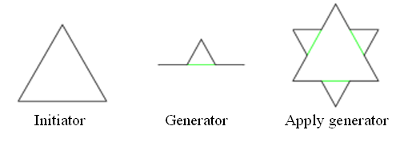
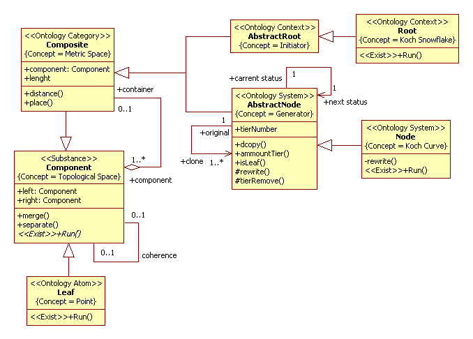
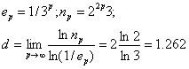
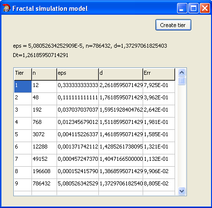

# Koch snowflake
Terms view on [Wikipedia](https://en.wikipedia.org/wiki/Fractal).
## Introduction
Mathematical abstractions exist in conceptual reality. The abstractions also can be simulated. 
Simulation model of mathematical abstraction build as simulation model of physical object.
Simulation of mathematical abstraction has many general with [constructive mathematics](https://en.wikipedia.org/wiki/Constructivism_(mathematics)) and used similar notions.
Also, for simulation of mathematical objects are useful notions and ideas [non-standard analysis](https://en.wikipedia.org/wiki/Non-standard_analysis), 
first of all notion of infinitesimal element.
We shall discuss mathematical objects such as geometric fractals because main principle SSP methodology is 
decomposition principle which set quasifractal structure of models. 
We shall considered object model of Koch snowflake. The model proposed in work [1], also see [2].

## Application domain
A procedure of construction of the Koch snowflake includes next steps:
- choose initiator and generator (see Fig.1);
- apply generator (see Fig.1);
- change the scale of the generator to 1/3
and replace previous two step n times.
<p></p>
Figure 1. Apply generator<br/>

More info view on [Wikipedia](https://en.wikipedia.org/wiki/Koch_snowflake)

## Analysis model
In UML2 SP, "space" notion is a container to components of system and denoted <<Space>> stereotype. 
But simulation model of mathematical object of "space" don't isn't <<Space>> class. 
Mathematical objects are objects of mental realty and simulate as objects of physical realty. 
<<Exist>> stereotype mean an operation to mathematical object.
A conceptual model in UML2 SP is an analysis class diagram. This diagram considered as ontology. 
Model the fractal is depicted in Fig.2.

<p></p>
Figure 2. The class diagram<br/>

### Description of a computational semantics
All objects of class have parallel threads.

### Description of an application domain semantics

We shall give definition of concepts to the ontology.

#### Topological Space
The “Component” frame define “Topological Space
” concept. The frame has «left and right» slots. It is defined "coupling" notion.

#### Geometry Point
The “Leaf” frame define “Geometry Point” concept. 
[Geometry Point](https://en.wikipedia.org/wiki/Point_(geometry))

#### Metric space
The "Composite" frame define "Metric space" concept.
A [metric space](https://en.wikipedia.org/wiki/Metric_space
) is a set for which distances between all members of the set are defined. Those distances, 
taken together, are called a metric on the set. "length" slot define "metric" concept. 
"distance()" operation  change a value of slot.

#### Generator
The "AbstractNode" frame define "Generator" concept. 
Generator is object which realise next process:
1. divide the line segment into three segments of equal length.
2. draw an equilateral triangle that has the middle segment from step 1 as its base and points outward.
3. remove the line segment that is the base of the triangle from step 2.
Method run this process is "revrite()" .
"isLeaf" slot define "Is leaf" concept. It have "true" value if object lie bottom tier.
The generator construct the Koch curve.

#### Initiator
The "AbstractRoot" frame define "Initiator" concept. 
The Initiator is initial object. If initiator is line then shall constructe Koch curves.
The Koch snowflake can be constructed by starting with an equilateral triangle.

### Non-standard elements
As mentioned above, for simulation of mathematical objects must use notions of non-standard analysis.
Object is non-standard element whenever can be executed rewrite operation. 
For action to non-standard element, must remember this.<br/>
If bottom tier consist instance of *Lief* class then object is a quasifractal.<br/>
If bottom tier consist instance of *Node* class then object is a fractal. It is potencial infinity object.<br/>

Now we represent simple example of non-standard element.<br/> 
Infinitely large linked list is a list such that has rewrite operation. Let *List* be class of linked list, let *Item* be class of list item. 
For *List*, defined next rewrite operation:
```
void leftRewrite() {
Item *ni = new Item;
ni->left = NULL;
ni->reght = head;
head = ni;
} ,
``` 
where *head* variable is head of linked list.
We can be define *insertItem()* or *deleteItem()* or other operation unless it do not conflict to rewrite operation. 
The *leftRewrite()* operation extend *List* class of finite linked list(a program class is a set in mathematics), 
added non-standard element. In considered case, it's posible.<br/>
Infinitely large linked list is a non-standard element. Also, first item of list is a non-standard element 
but item of list tail isn't a non-standard element.<br/>
If List class has "divide" operation then Item class define infinitesimal elements. 

## Verification
We denote the Hausdorff dimension by *d*. Let *e* be a length of covering, 
let *n* be an amount of elements of covering. First two a step can calculate to hand.<br/> 
In the first step, *p* = 1, *e* = 1/3, *n* = 3x4 = 12, *d* =ln*N(e)*/ln(1/*e*) = 2.48490665/1.098612289 = 2.261859507.<br/> 
In the second step, *p* = 2, *e* = (1/3)/3 = 1/9, *n* = 4x4x3 = 48, *d* = 3.871201011/ 2.197224577= 1.761859507.<br/>
In this way, 
<p></p> 
i.e., accurate value *d* is 1.262<br/> 
The result of measurement to simulation model is shown on Fig. 3, where Dt is accurate value of Hausdorff dimension, eps is *e*.
<p></p>
Figure 3. Results of measurement to simulation model<br/>
As we see, the measurement value of Hausdorff dimension converges to accurate value.

## The simulation model in C++ code:  
[ClassesOfFractalProject.h](https://github.com/vgurianov/uml-sp/blob/master/examples/fractal/ClassesOfFractalProject.h), 
[ClassesOfFractalProject.cpp](https://github.com/vgurianov/uml-sp/blob/master/examples/fractal/ClassesOfFractalProject.cpp)

## Conclusion
In this section considered object model of Koch snowflake. This model can use to construct other fractals such as Cantor ternary set and more complex.<br/>
Also, other examples of simulation model of mathematical objects see [3]. 

## References
1.	Gurianov V.I. Object Modeling of Fractal Structures // Mathematical Models and Their Applications: 
Sat. sci. tr. Issue. 13. - Cheboksary: Publishing house Chuvash. University, 2011.- P. 148-159
2.	[V.I. Gurianov, Simulation with UML SP. Cheboksary: SPbSEU, branch in Cheboksary, 2014. - 136 p.(In Russian)](http://simulation.su/static/en-books.html)
3.	[Shamin R.V. Modern numerical methods in object-oriented presentation in C #, - 2011. (In Russian)](http://www.intuit.ru/studies/courses/671/527/info)


