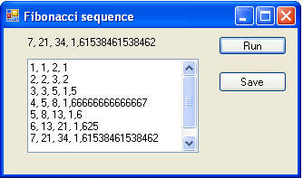

# Numerical and object models

## Introduction
At now wide use numerical methods. In UML2 SP models, numerical calculation nearly use not. Model describe as an ontology but do not as differential equation. It is a distinctive quality of our approach. An ontology is alternative way of modeling. In this section we shall discuss it topic. 

## Measurements
Let us explain where the numerical values in object models come from. Consider the following example.<br/>
The Fibonacci sequence is a sequence of number when Fn = Fn-1 + Fn-2 with seed values F0 = F1 = 1, 
i.e. any number is sum two previous numbers.<br/>

**A numerical model** in C# is
```
public void fbSequenceNumericalModel()
{
  int fb0, fb1, fb;
  fb0 = 1; fb1 = 1;
  for (int i = 2; i<12; i++) 
  {
    fb = fb0 + fb1;
    probe = i.ToString() + ", " + fb.ToString()
    fb0 = fb1; fb1 = fb;
  }
},
```
where the *probe* variable is an output data.

**An object model** is following.<br/>
[In the Fibonacci book](https://en.wikipedia.org/wiki/Fibonacci_number), this sequence is result of growth of a rabbit population.
Let exist one pair of rabbits in start. Mating pair always produces one new pair at one month.
New pair grow one month and do not produces new pair. How many pairs will there be in one year?<br/>
Let *Node* class be model of pair of rabbits. A *State* attribute of *Node* is a state of the pair and has two values: mature state or childish state.<br/> 
The pairs put to cages and the cages build in row. The *previous* and *next* attributes define place of cage to the row.<br/> 
Let *x* and *y* be head of linked lists. The *x* attribute simulate sequence of months of year, the *y* simulate row of cages.
In constructor of *Node* defined initial data
```
            y = new Node(); y.state = false;
            y.next = new Node(); y.next.state = true;
```
We consider following algorithm
```
        public void fbSequence()
        {
            if (t != null)
            {
                ix++;
                Node tmp = y; int iy = 0; int yy = 0; Node yt;
                do
                {
                    if (tmp.state)
                    {
                        iy++;
                        yt = new Node(); yt.next = y; y = yt; }
                    else { tmp.state = true; };

                tmp = tmp.next; yy++;
                } while (tmp != null);

                t = t.next; 
                probe = ix.ToString() + ", " + iy.ToString()+ 
                ", " + yy.ToString();
            }
            else probe = "The end";
        },
```
where *ix* is counter of months, *iy* is counter of mature pairs, *yy* is counter of any pair, *t* is current node 
of *x* linked list. New node insert to head of linked list.
The run result of the simulation is depicted in Fig.1
<p></p>
Figure 1. The Fibonacci sequence simulation<br>

As we see, measurements of simulation give the Fibonacci sequence.<br/>
**Summary:** In object models, numerical data is result of measurements on object structures.

### The simulation model in C# code:  
[Fibbonachy.cs](https://github.com/vgurianov/uml-sp/blob/master/examples/function/Fibbonachy.cs) 

## Conclusion
In this section we discussed numerical and object models. In object models, numerical data is result of measurements  on object structures. In object models, numerical calculations should be avoided because this violates the integrity of the ontology. However, for real models often have to use numerical calculations to reduce the complexity of the model. 

## References
1.	[V.I. Gurianov, Simulation with UML SP. Cheboksary: SPbSEU, branch in Cheboksary, 2014. - 136 p.(In Russian)](http://simulation.su/static/en-books.html)
