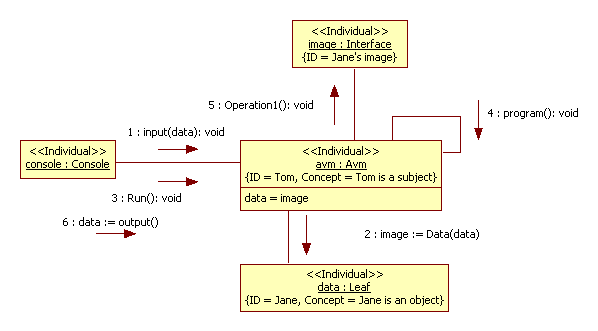
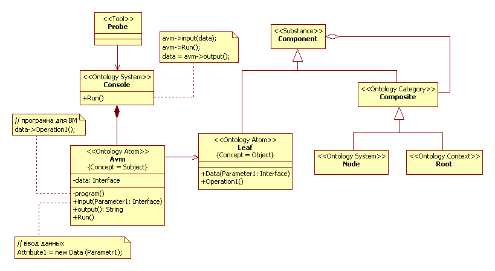
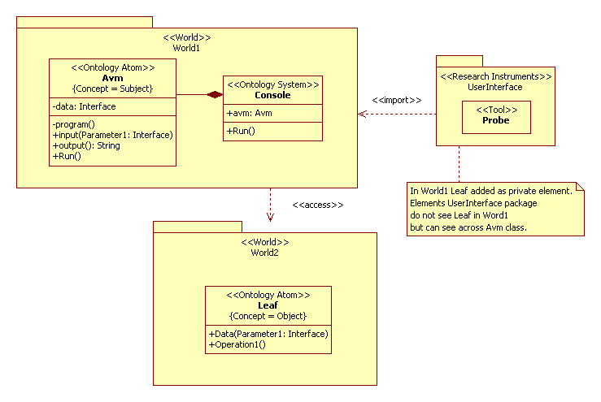

# Reflexion
## Introduction
Sometimes in simulation research need to consider several simulation models at the same time, for example 
result of study to one model used to other model.  Then there is dependency between models. 
In UML2 SP used \<<World>>, \<<Worlds>>, and \<<Accessibility Relation>> stereotypes for description this dependence. 
The <World> stereotype used for package of concrete classes of simulation model. 
The \<<Worlds>> include \<<World>> packages and \<<Accessibility Relation>>  dependence between them.
In methodology SSP this elements consider as an interpretation of modal logic by S. Kripke [1, 2].
[Kripke structure](https://en.wikipedia.org/wiki/Accessibility_relation) is a triple <G, K, R>, 
where G is possible worlds, K (element G) is actual world, and R is the accessibility relation. 
Actual world is world where disposition \<<Researcher>>.
There are three different Kripke structure:
- direct accessibility (parallel worlds; it is ordinary case several versions of  model )
- sequential accessibility (fractal or recursive worlds; first we create a VM [(virtual machine)](https://en.wikipedia.org/wiki/Virtual_machine), and then we build a model in it)
- global variables (interpenetrating worlds).
These models suggest in work [3]. In this section consider a particular case of fractal worlds, it is a reflection.

## Application domain. 
In the book [4, p.248] considered a conceptual graphs for representation knowledge. 
There an example is given conceptual graph of the statement “Tom believes that Jane likes pizza”. 
It is use of a propositional concept. 

## Analysis model
Terms “Subject” and “Object” are antonyms. Subject reflect object. 
A communication process between subject, object, and image of object is depicted in Fig.1.
<p></p>
Figure 1. The communication diagram<br/>

Thus, as follows from communication diagram, a class diagram shall have a form as is depicted in Fig.2.
<p></p>
Figure 2. The class diagram<br/>

### Description of a computational semantics 
Abstract virtual machine (AVM) is model of the subject. AVM has memory, processor, input and output. 
On console executed next a sequence commands. It are input data, program execute, and print of result. 
The input operation calls a copy constructor and creates copy of 'date' object. The program consists at a one operator. 
The operator executes an authorized operation to data. It is Operation1() operation.

### Description of an application domain semantics
What is inaccessibility, inaccessible world? Assume that data is a ciphertext (for example, Maya codices). 
World described in manuscript us is an inaccessible. But it's world to be accessible if text will be deciphered. 
For decipher can use a decryption machine. And conversely, world can make inaccessible if ciphered the text. 
In this way, Kripke structure is a base notion of cryptology theory. 
The architectural diagram is depicted in Fig.3.
<p></p>
Figure 3. 	The architectural diagram<br/>

For description of accessibility we use «access» stereotype. The UML 2.4.1 spec says "A package import is shown 
using a dashed arrow with an open arrowhead from the importing namespace to the imported package. 
A keyword is shown near the dashed arrow to identify which kind of package import is intended. 
The predefined keywords are «import» for a public package import, and «access» for a private package import."[5, page 112] 
I.e. Leaf class for Probe class is a private element (in Word1) but is a public element (in Word2) for Avm class. 
A Probe class don't see Leaf class but has access to it across Avm class.

## Design model
In C++ realized package import as <<import>>. We use next reception.<br/>
Definition of namespaces
```
namespace Data_Process {
…
class Leaf : public Component { …
…
} //namespace Data_Process

namespace Abstract_Virtual_Machine {
using namespace Data_Process;  // it is <<import>> but need <<access>>
…
} //namespace Abstract_Virtual_Machine

Using
// it is <<import>> (can not use):
it is <<access>> (can use):
using Abstract_Virtual_Machine::Console;     
//Leaf *d = new Leaf; d-> value;  //don't see

Console *console = new Console;
console->Run();
Label1->Caption = console->probe;
```

## The simulation model in C++ code:  
[ClassesOfAvmProject.h](https://github.com/vgurianov/uml-sp/blob/master/examples/kripke/ClassesOfAvmProject.h), 
[ClassesOfAvmProject.cpp](https://github.com/vgurianov/uml-sp/blob/master/examples/kripke/ClassesOfAvmProject.cpp)

## Conclusion
In this section we have discussed the reflection phenomena. It is the example use \<<World>>, \<<Worlds>>, 
and \<<Accessibility Relation>> stereotypes. 
The considered theme (topic) is very an extensive and this section is limited introduction in the problem.

## References.

1.	"A Completeness Theorem in Modal Logic", Journal of Symbolic Logic 24(1):1–14. 1959.
2.	"Semantical Considerations on Modal Logic", Acta Philosophica Fennica 16:83–94,1963.
3.	[V.I. Gurianov, Simulation with UML SP. Cheboksary: SPbSEU, branch in Cheboksary, 2014. - 136 p.  (In Russian),](http://simulation.su/static/en-books.html)
4.	G. F. Luger, Artificial Intelligence: Structures and Strategies for Complex Problem Solving. 6th edition, 
Addison Wesley, 2008
5.	[UML Superstructure Specification, v2.4.1](http://www.omg.org/spec/UML/2.4.1/Superstructure/PDF)

