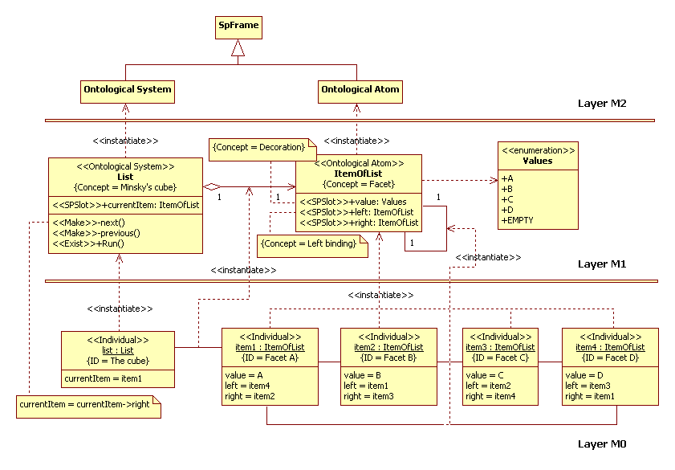

# Minsky's cube
In work "A Framework for Representing Knowledge" by Marvin Minsky considered a simple example of frame,
for example view on [http://web.media.mit.edu](http://web.media.mit.edu/~minsky/papers/Frames/frames.html).
This is frame of cube (see section "Tracking the image of a cube"). We shall consider this model in UML2 SP notation.
## Example by M.Minsky
The "A" and "B" symbols represent decorations on two facets of the cube. 
Can be moved view point into right or revolve of cube into left.

Figure 1. The perspective appearances of a cube (picture from http://web.media.mit.edu/~minsky/papers/Frames/frames.html) 
If make excursion around the cube then the "A" facet is disappears and "C" facet is appears.
## Formal description of 'Cube' notion
In UML2 SP a definition diagram is intended to accurate define of concepts. 
A definition diagram is a three-layer diagram and include M0 (objects layer), M1 (classes layer), and M2 (metamodel layer). 
This diagram is depicted in Fig.2.

Figure 2. Formal describtion of the cube 
The “List” frame define “Minsky’s cube” concept. The frame is instance "Ontology System" UML-element 
(daughter "SPFrame" element, i.e. frame). The frame has example. It is "list" object.  
The frame has “currentItem” slot. It is slot define “face” concept. Face of cube is a visible facet of cube. 
The slot has a type. The "ItemOfList" class defines the type; 
«next» and «previous» operations define change rule of the slot value. The operations call from "Run" operation. 
A type is a set of values and authorized operations. The "ItemOfList" class is a set of objects. 
This objects depicted in Fig.2. in M0 layer. 
The "ItemOfList" class is a frame, it is instance "Ontology Atom" UML-element as depicted in Fig.1. in M2 layer. 
The frame define "Facet" concept. The "Facet" notion includes "Decoration" and "Binding" concepts.  
The "value", "left", and "right" slots define this concepts.
## The simulation model in C++ code:  
[ClassesOfMinskyProject.h](https://github.com/vgurianov/uml-sp/blob/master/examples/minsky/ClassesOfMinskyProject.h), 
[ClassesOfMinskyProject.cpp](https://github.com/vgurianov/uml-sp/blob/master/examples/minsky/ClassesOfMinskyProject.cpp)
## References
1. Minsky, Marvin. A framework for representing knowledge. MIT AI Laboratory Memo 306, June, 1974.
 
