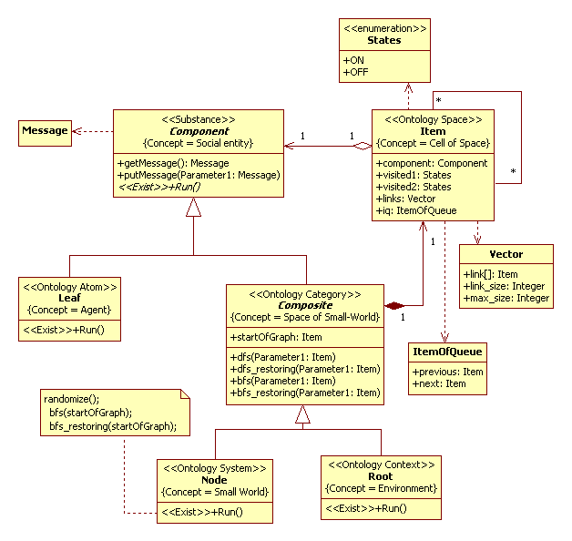

# Space of Small World
in progress ...

## Introduction
In SSP methodology, main principle is a decomposition principle. For decomposition used *Composite* pattern. The *«Ontology space»* class is  a reification of one-to-many relationship. This object structure is called configuration space of system. Usually, it is a linked list or tree. However, a configuration space of system can be very complex structure. Moreover, a configuration space of system can change to time. 
In this section, we discuss a dynamics of configuration space.

## Application domain
A [small-world](https://en.wikipedia.org/wiki/Small-world_network) model is a model of social network. The small-world network is a network with specific features including short average path lengths and high clustering. 
In 1998, Duncan J. Watts and Steven Strogatz was proposed procedure for interpolating between a regular ring lattice and a random network [1]. The Watts–Strogatz model is a model that produces graphs with small-world properties (Fig.1).

Figure 1. The Watts–Strogatz model (from [1]) 

The model constructs an undirected graph in the following way. 
- Precondition. Constructed a regular ring lattice, a graph with nodes each connected with close neighbors.
- Process. For every node take every edge and rewrite it with probability p. Rewriting is avoid of self-loops and link duplication. 
- Postcondition. Random graph.
If p= 0.5 then random graph is analog of Small-World network. 

More information see on [wiki](https://en.wikipedia.org/wiki/Watts%E2%80%93Strogatz_model). 
We use this idea for simulate dynamics of space.

## Analysis model
Our model differs from the Watts–Strogatz model in details.
In UML2 SP, a conceptual model is an ontology, which draws as an analysis class diagram. Model of the Small-World is depicted in Fig.2. 

Figure 2. 	Model of the Small World 

Description of application domain semantics.

Ontology define a set concepts: Social entity, Agent, Space 
of Small-World, Cell of Space, Environment, Small-World. We discuss “Space of Small-World” concept in detail.

The “Item” frame define "Cell of Space" concept. This concept has "visited", "visited1" attributes. We suggest two-layer model of interaction. The "visited", "visited1" attributes mark activity on first and second layers. The links ("Vector" structure) attribute is a friends list and it define first layer of graph. The iq ("ItemOfQueue" structure) attribute is a full path on graph and it define second layer of graph. 
The “Composite” frame define "Space of Small-World" concept. The frame has headOfList attribute. It is attribute define an entry point to a graph and is some node of graph. For "Space of Small-World" define two activities.  
The first activity we simulate as [Depth-first search (DFS)](https://en.wikipedia.org/wiki/Depth-first_search) algorithm. The algorithm is a traversing by graph data structure and similar a diffusion of fire in forest. The dfs() operation define “Perturbation of space” concept. Communication diagram for this activity is depicted in Fig.3.

Figure 3. 	The “Perturbation of space” activity 

First of all, for current node executed "do()" operation. Further, node request a contacts list (getContactList() operation). The set of contacts add to tail of queue (addContact() operation). In end, from head of queue take new item. This algorithm repeats while queue is not empty.   
The do() operation is a "to tear a near link" act and it generates bfs() activity. 
The second activity we simulate as [Breadth-first search (BFS)](https://en.wikipedia.org/wiki/Breadth-first_search) algorithm. This activity can use DFS algorithm but BFS is a more interesting. The bfs() operation define “Rewrite links” concept. A communication diagram for this activity is depicted in Fig.4.

Figure 4. 	The “Rewrite links” activity 

First of all, for current item executed "do()" operation. Further, node requests a contact from contact list. For this contact execute dfs() operation. And so on, i.e. dfs() has recursive call. 
The "do()" operation is a "Create new link" act. In this model, a probability of new contact is constant but this is optional. Possible, "far" and "near" notions binded with "temperature" notion. If temperature is low then close ties has highest probability. 
The dfs() activity sets out "visited" attribute to "OFF". A dfs_restoring() operation restore it attribute to "ON". Similarly, a bfs_restoring() operation restore "visited1" attribute. So, activity can be to repeat again.

## The simulation model in C++ code:  
[ClassesOfFractalProject.h](https://github.com/vgurianov/uml-sp/blob/master/examples/fractal/ClassesOfFractalProject.h), 
[ClassesOfFractalProject.cpp](https://github.com/vgurianov/uml-sp/blob/master/examples/fractal/ClassesOfFractalProject.cpp)

## Conclusion
In this paper we have discussed a configuration space of a simulation models. The configuration space of model can very differ from habitual physical space and, in general case, is network. This network is a random graph, which can change its topology to time.

## References
[1]	Watts, D. J.; Strogatz, S. H. (1998). "Collective dynamics of 'small-world' networks". Nature. 393 (6684): [doi:10.1038/30918](https://www.nature.com/articles/30918).
