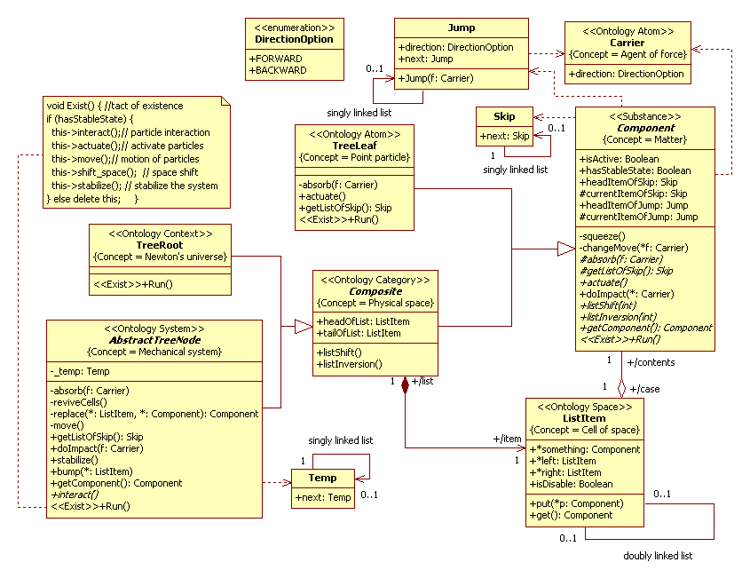
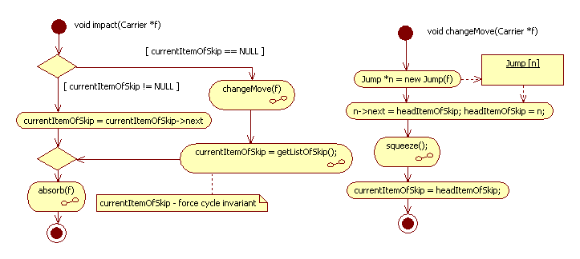
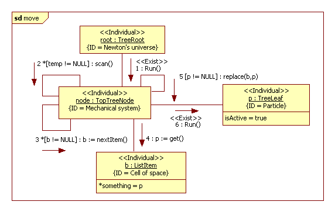
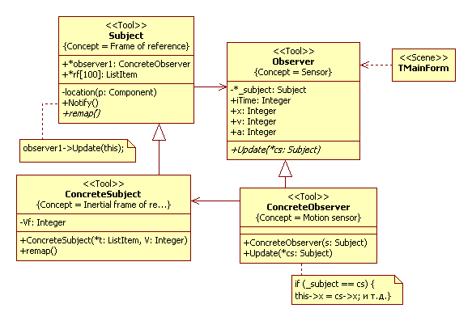
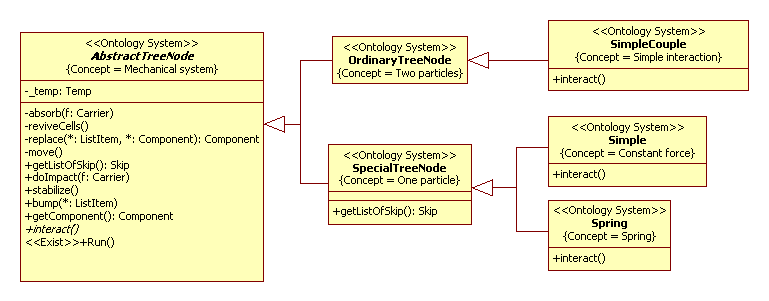
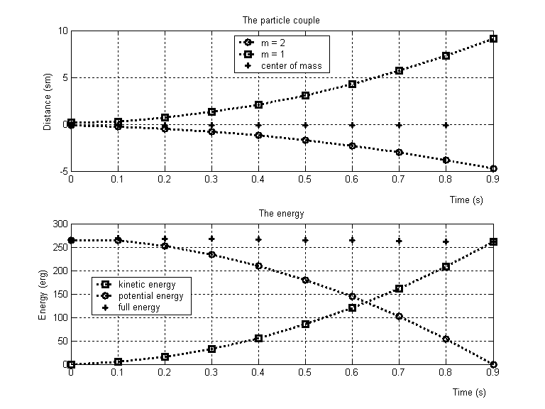

# Mechanical motion
Terms view on [Wikipedia](https://en.wikipedia.org/wiki/Classical_mechanics).
## Introduction
 [Computational physics](https://en.wikipedia.org/wiki/Computational_physics) large wide use to modern scientific research.  
 However, models of computational physics are not simulation models. The simulation model reproduces the message exchange protocol between the components of the system under study. Somewhat simplifying, we can say that the simulation model and 
the object of study should have the same behavioral algorithm. The numerical model reproduces operations with numbers and, 
in general, modeling mathematical object. For example, solving the equations of Newton's motion, 
the numerical model reproduces not the motion of a point particle, but the process of solving a differential equation. 
In this way, where is a problem of development of physical simulation models. 
You can object, in physics have been created many qualitative mathematical models, modern numerical methods are effective, 
and researcher no need to other approaches. With it we can argue - a new approach always eventually gives something new.

In this section, we shall discuss simulation in physics.The simulation model of classical mechanical motion was propose 
in papers [1-3]. This model based on the Levi-Beck theory of mechanical motion in discrete space-time.
## Related Works
There are works on simulation modeling in physics but they are few and most part are case studies. These works cannot compete with works of performed in a traditional manner of research.
There is a problem of an adequate description of physical processes in the language of simulation modeling. In the book [4] this approach is called *algorithmic* or *constructive physics*. Similar views are held by the authors of the [book [5]](https://mitpress.mit.edu/books/structure-and-interpretation-classical-mechanics).
This problem is closely related to the problems of [digital physics [6]](https://en.wikipedia.org/wiki/Digital_physics) (see [digital mechanics book](http://52.7.130.124/wp-content/uploads/2015/07/digital_mechanics_book.pdf)) and the methods of information physics [7]. Let's note, simulation in physics is not the same as information physics, but, of course, these are close approaches.

## Application Domain
Newton's laws
- First law:	In an inertial frame of reference, an object either remains at rest or continues to move at a constant velocity, 
unless acted upon by a force. 
- Second law:	In an inertial reference frame, the vector sum of the forces F on an object is equal to the mass m 
of that object multiplied by the acceleration a of the object: F = ma. 
- Third law:	When one body exerts a force on a second body, the second body simultaneously exerts a force equal 
in magnitude and opposite in direction on the first body.

More info view on [Wikipedia](https://en.wikipedia.org/wiki/Newton%27s_laws_of_motion).

## Analysis model
Fundamentals of mechanical motion in discrete space-time were developed in the period of the birth of quantum mechanics [8]. In our opinion, these views can become a theoretical basis for constructing simulation models. We will not discuss the question of the discreteness of physical space. Our task is to find ways to adequately describe the mechanical motion by means of simulation modeling.<br/>

In our model, we use a two-layer architecture (see Fig. 1), which allows us to separate the components of the model into two levels of abstraction. The lower layer defines abstract model classes (see Figure 3), such as *Component*, *Composite*, and *ListItem*. The *ReusableClassesOfInterface* package contains abstract classes modeling the research installation and the user interface libraries (we use VCL). Top-layer packages define specific classes, such as *ConcreteTreeNode*, *TreeLeaf*, *TreeRoot*, and classes of a specific simulation model. In UML2 SP, an architectural diagram in terms of subject semantics is an interpreted as a conceptual graph.
<p></p>
Figure 1. Architectural analysis of the class diagram<br/>

Package «Epistemology Entity». This package defines the procedure for measuring the main characteristics of the mechanical movement - time, position, speed and acceleration. Both packages «Epistemology Entity» and «Research Instruments» named *Epistemology partition*.<br/>
Package «Ontology Entity». This package has the marked meaning "Classical mechanics" in the sense that by theory we mean the classification of mechanical systems. Both packages «Ontology Entity» and «World» named *Ontology partition*.

### 1. Ontology partition
A conceptual model in UML2 SP is an analysis class diagram. This diagram considered as ontology. 
Model a mechanical motion is depicted in Fig.2.  
<p></p>
Figure 2. The class diagram<br/>

#### Description of a computational semantics
All objects of class have parallel threads.

#### Description of an application domain semantics
We shall give definition of concepts to the ontology. The architecture of the model defines the pattern Composite [14], which defines the hierarchy of nested mechanical subsystems. Unlike the classic pattern [14], aggregation materializes through a linked list with ListItem elements.

##### Matter
The “Component” frame define “Matter” concept. In the classical physics, [matter](https://en.wikipedia.org/wiki/Matter) is any substance that has mass and takes up space by having volume. 
The frame has headItemOfJump and currentItemOfJump slots. It is define “Resource of motion” concept.
The frame has headItemOfSkip and currentItemOfSkip slots. It is define “The inertial mass” concept. The property of body is called inertia. A quantitative measure of inertia is [mass](https://en.wikipedia.org/wiki/Mass).<br/>
The *doImpact()* method define “Influence” concept. The concept describes to act of force to body and change value headItemOfJump slot.<br/> 
**Newton's second law.** In 1926, Levi proposed the following mechanism action of force [8, P.98]. 
The force acts on the particle not constantly, but every τ sec (τ~E-23 sec).
On any other particle, whose mass is N times larger, the force acts every Nτ sec.<br/>
We use the *Carrier* class such that generates new instances of the *headItemOfJump* list. The *Component* class has both *headItemOfSkip* and *currentItemOfSkip* fields of type *Skip*. This list simulates the inertia of a particle when skips objects of Carrier. A quantity of skip is quantity elements in the headItemOfSkip list (see Fig.3). If ‘currentItemOfSkip’ list end then object of *Carrier* is processed. The *changeMove()* method change length of the list. 
The *absorb()* method change a state of object *Carrier* class. The *getListOfSkip()* method return a pointer *headItemOfSkip*. Both methods *absorb()* and *getListOfSkip()* are abstract methods and shall be must define in a concrete class. A detailed of algorithmic record of Newton's 2nd law is discussed in [12].

<p></p>
Figure 3. Algorithmic recording of Newton's second law<br/>

##### Point particle
The “TreeLeaf” frame define “Point particle” concept. A [point particle](https://en.wikipedia.org/wiki/Point_particle) is 
an appropriate representation of any object whose size, shape, and structure is irrelevant in a given context.
The *TreeLeaf* define both methods *absorb()* and *getListOfSkip()*. The *absorb()* method change direction of *Carrier* to the contrary. The *getListOfSkip()* method return a pointer *headItemOfSkip*.
The *«Exist»Run()* method define rule of change of *isActive* value.
```
void Run(){
		if (currentItemOfJump->next != NULL) {
		if (currentItemOfJump != NULL) {
			currentItemOfJump = currentItemOfJump->next;
		} else {isActive = false;};
	}
``` 
The actuate() method make particle is the active
```
	void actuate() {
	if (headItemOfJump != NULL) {isActive = true; };
	currentItemOfJump = headItemOfJump;
	}
```
##### Agent of force
The “Carrier” frame define “Agent of force” concept. Agent of force is a carrier of interaction. The frame has «Direction» slot. In 1-dimension space, it is field can has two value are backward and forward.

##### Cell of space
The “Composite” frame define “Cell of space” concept. The frame has «left» and «right» slots. It is defined "coupling" (or "topology") notion. The frame has “something” slot. It is define "content" notion.

##### Physical space
The base (the headOfList attribute) and the anchor points (tailOfList attribute) that specify the direction in space model the physical space. From the point of view of computational semantics, space is an N-dimensional linked list of instances of the *ListItem* class.
The space assembly is
```
for (int i = 0; i < 1000; i++) m[i] = NULL;
	
	for (int i = 0; i < N; i++) { // N - resolution of space
		m[i] = new ListItem; m[i]->x = i;
	};
	ListItem *a;
	for (int i = 0; i < N; i++) {
	a = m[i];
	if (i<N-1) a->right = m[i+1]; if (i>0) a->left = m[i-1];
	};
	headOfList = m[1];    // base of space
	tailOfList = m[N-1];  // anchor point 
```
Further, we confine ourselves to a one-dimensional space. The listShift() and listInversion() method are operations above space.

##### Mechanical system
The “AbstractTreeNode” frame define “Mechanical system” concept. This class defines abstract operation Run(). The *<<Exist>>Run()* method is
```
	void Run() { //  ** quantum of existence of the system

if (hasStableState) {
this->interact();  // ** particles interaction
this->actuate();   // ** activate particles
this->move(); // ** displacement of point particles
this->listShift();  // movement of the system
this->Stabilize();
} else { ShowMessage("decay "+frame->Caption);
		delete this;
		 };
```
The interaction() method define particles interaction. It method is abstract method and must defined to concrete classes.  For this method defined constraint.<br/> 
**Newton’s third law.** This law is specified as a constraint: the *doImpact()* method can only be used in pairs. For example, the following pair of interactions
```
f = p-> doImpact (f); // p - the point particle 
f = headOfList-> something-> doImpact(f); // massive body
```
The move() method define a motion of particles.<br/>
**Newton's first law.** To solve the isotachy problem, we used a somewhat modified theory of mechanical motion in discrete space-time, proposed by Beck in 1929 [8, P.28]. 
The essence of this theory is as follows. A moving point particle has some stock of motion, which in our case is modeling by a linked list from Jump instances. The faster particles have a longer list. The move() method of the AbstractTreeNode class executes a single jump (replace (b, p) method), after which the list is reduced by one position (the "Exist" Run() method of the TreeLeaf class). If the list is exhausted, the particle is deactivating and will no longer move. The move() method is called many times, so that all the particles finish moving. The call() loop is organized as a linked list of the Temp class instances. In detail, this mechanism is discuses in [2]. 
<p></p>
Figure 4. Activity move()<br/> 

The *doImpact()* method.<br/>
The *doImpact()* method simulate act of external force to mechanical system and call *absorb()* and *getListOfSkip()* methods. Both methods are abstract methods. The *absorb()* method simulate deformation of system and defined to concrete classes. The *AbstractTreeNode* partly define doImpact() method. It is *getListOfSkip()* method. The *getListOfSkip()* method return mass of mechanical system and expresses property of additivity of mass

##### Newton's universe
The “TreeRoot” frame define “Newton's universe” concept. The TreeRoot class specifies the initial and boundary conditions.

The Newton three laws must supplement by yet two propositions.<br/> 
**Collision**. To resolve the collision situation, in the *AbstractTreeNode* class defined the *bump()* method. The method is virtual and can substitute in descendants of the *AbstractTreeNode* class. If a method of the *AbstractTreeNode* class is caused by then it is an absolutely elastic collision.<br/> 
**Disintegration**. The AbstractTreeNode class defines a private field hasStableState. If this field is false, the system self-destructs. This field can be changed by the procedure *stabilize()*, which can be substituted in descendants of the *AbstractTreeNode* class. If the *AbstractTreeNode* method is caused by then the field is set to true.


### 2. Epistemology partition
#### 1. Tools of measurement

The measurement procedure include a controlled violation of class encapsulation. The model of the measuring system is a depicted in Fig.5.

One of the most effective methods of studying space is the lattice method, which is an analog of Descartes' coordinate method. The essence of the method is to map the space to an array of the appropriate dimension, and to make measurements using an array. The mapping must updated at each step of the time In Fig.5, the Subject class simulate a reference frame.
The Subject class has an array of rf pointers of type Item.
The model of the measuring device create based on the Observer pattern [14]. The Notify () method of the Subject class is called from the "Exist" Run () method of the AbstractTreeNode class after all mechanical processes are completed.
<p></p>
Figure 5. Model of measuring system<br/>

Specific ConcreteSubject classes define reference frames (RF) of different kinds, for example, inertial reference frames (IRF), non-inertial RF (NRF), frames with non-card coordinates, etc. Next, we will mainly use IRF.


#### 2. Natural and standard units of measurement 

Measurements in discrete models are much more convenient to carry out in natural units of measurement. Let us give the formulas for the conversion of natural units of measure to standard ones and back.
The basic units of measurement in the CGS are centimeter, gram, and second. Let l [cm] = l'/λ, m [g] = m'/μ, t [s] = t'/τ, where the natural units of measurement (dashed) are measured in the number of instances of the Item, Skip and number of cycles Exist. The case of a unit mass corresponds to a situation where the list of instances of Skip is empty (that is, particles with 0 mass do not exist). The triple of numbers (λ, μ, τ)  will called the *resolution of the model*.<br/>
Consider the derived units. The speed is expressed in the number of v' instances of the Jump class in the motion amount list; v [cm/s] = (τ/λ)v' or v' = (λ/τ)v. Acceleration is also expressed in the number of a' instances of the Jump class, because this is the difference of the two lists of momentum; a[cm/s2] = a' х τ²/λ. Force is the quantity of F' acts of interaction: F[dyne, g • cm/s²] = ma = m'/μ х (τ²/λ)a' = τ²/(μλ) х F'. The conversion factor can be fractional; to give a physical meaning to such coefficients, the ratio must multiplied by a certain power of 10. Energy and work in natural units are measured in the number of acts of work. The act of work is a single movement of a particle from one cell to another with a single act of interaction. The work A [erg] = Fs = τ²/(μ λ)F' х s'/λ = (τ/λ)²/μ х A'.

## Verification
Verification of the model was carried out on typical problems of mechanics: the motion of a material point under the action of a constant force, under the influence of a spring, and in the interaction of two material points (see Fig 6).
<p></p>
Figure 6. Concrete classes diagram<br/>

We consider model of two particles.
The resolution of the model is λ= 10, μ = 1, τ = 10. Two particles with masses m1 = 2 g (1 Skip) and m2 = 1 g (no Skip - empty list) interact so that the repulsive force is independent of distance and is F = τ²/(μλ) × F' = 10²/(1×10) × 1 = 10 dynes (use packet include 2 acts of interaction, the minimum packet that does not violate the integrity of the quantum of existence of the system). These values are chosen because they define the minimal interaction model.

<p></p>
Figure 7. The graph of the motion of a pair of particles and the change in the potential, kinetic, and total energy of the system<br/>

In this experiment, the laws of conservation of momentum and energy for a closed system were verified. At the initial instant, the particles are at rest. The center of mass is at the origin of the coordinate system, the particle m1 at the point x1 = -0.1, the particle m2 at the point x2 = 0.2. Figure 7 shows the graphs of the motion of both particles and the center of inertia r = (m1x1 + m2x2) / (m1 + m2) (marked with crosses).
The lower part of the figure shows the graphs of potential (circle), kinetic (square) and total (cross) energy. The zero of the potential energy is chosen at infinity (13.6 cm at t = 0.9 sec). Potential and kinetic energy was measured by a direct method; for this, the simulation method was used. It should pay attention to reducing the total energy of the system. This is an analog of computational (countable) viscosity in numerical methods. 

## The simulation model in C++ code: 
[AppBaseClasses.h](https://github.com/vgurianov/uml-sp/blob/master/examples/newton/AppBaseClasses.h), 
[AppBaseClasses.cpp](https://github.com/vgurianov/uml-sp/blob/master/examples/newton/AppBaseClasses.cpp)<br/>
[IntermediateLevel.h](https://github.com/vgurianov/uml-sp/blob/master/examples/newton/IntermediateLevel.h), 
[IntermediateLevel.cpp](https://github.com/vgurianov/uml-sp/blob/master/examples/newton/IntermediateLevel.cpp)<br/>
[Models.h](https://github.com/vgurianov/uml-sp/blob/master/examples/newton/Models.h), 
[Models.cpp](https://github.com/vgurianov/uml-sp/blob/master/examples/newton/Models.cpp)<br/>
[TreeRoot.h](https://github.com/vgurianov/uml-sp/blob/master/examples/newton/TreeRoot.h), 
[TreeRoot.cpp](https://github.com/vgurianov/uml-sp/blob/master/examples/newton/TreeRoot.cpp)

## Conclusion
In this section considered object model of classical mechanic motion in discrete space-time.Along with the models considered above, other models were also studied. We mention the most interesting of them: a plane shock wave in a solid, the motion of a metal chain, the decay of a freely falling liquid stream, photonic nanostructures, and a number of problems in the theory of impact.
A comparative analysis of the object model with numerical methods such as the particle method in Harlow cells, the large particle method (the Davydov-Belotserkovsky method), and the molecular dynamics method is performed.<br/>
In our opinion, the above results allow us to state that the proposed model of mechanical motion adequately describes mechanical processes.

## References
1. Gurianov V.I. Models of constructive physics in the classical mechanics of a material point. // Mathematical models and their applications: Sat. sci. tr. Issue. 15. - Cheboksary: Publishing house Chuvash. Univ., 2013. - P. 148-159.
2. Gurianov V.I. Dynamics, Levy’s theory and the inertial mass // Mathematical models and their applications: coll. sci. tr .: is dedicated to the 80th anniversary of the birth of AG Terentyev, Vyp. 18. - Cheboksary: Publishing house Chuvash. Univ., 2016. - P. 221-231.
3. Gurianov V.I. Verification of discrete model of mechanical motion // Mathematical models and their applications: Sat. sci. tr. Issue. 19. - Cheboksary: Publishing house Chuvash. Univ., 2017. - P. 97-105.
4. Ozhigov Yu.I. Constructive physics. - SRC "Regular and chaotic dynamics", 2010. - 440 p.
5. [Structure and Interpretation of Classical Mechanics By Gerald Jay Sussman and Jack Wisdom](https://mitpress.mit.edu/books/structure-and-interpretation-classical-mechanics). Also, see [project on GitHub](https://github.com/hnarayanan/sicm).
6. Website E. Fredkin on Digital Philosophy, URL: [http://www.digitalphilosophy.org/](http://www.digitalphilosophy.org/)
7. Vstovsky G.V. Elements of Information Physics. Moscow: RIC MGIU, 2002. - 257 p.
8. Vyaltsev A.N., Discrete space-time. Ed. 3rd, stereotyped. - M .: KomKniga, 2007. - 400 p.

