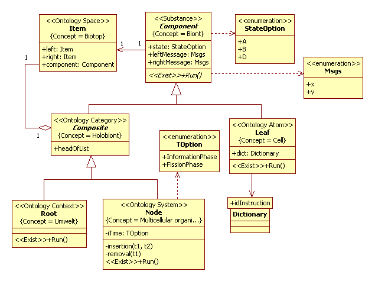
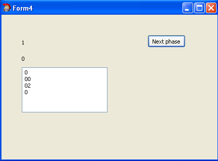

# Multicellular organism
Terms view on [Wikipedia](https://en.wikipedia.org/wiki/Multicellular_organism)
## Introduction
Biology is science, where simulation use very much widely to investigations. Many problems of biology have general scientific 
character. In simulation modeling, a life is a stable process of self reproduction. 
A life can have different foundation, chemical, electric or digital, but on view of simulation it is same one model. 
For example, great interest is viruses on base social elements.  It is same life. Typical example is a habit of smoking.<br/>
One of the problems of biology is problem of [morphogenesis](https://en.wikipedia.org/wiki/Morphogenesis). 
From one cell develop multicellular organism certain shape. What is nature of self organization? 
In foundation of computing modeling of morphogenesis lie the two approach. 
First approach is [Von Neumann cellular automaton](https://en.wikipedia.org/wiki/Von_Neumann_cellular_automaton). 
Second approach is the [L-system](https://en.wikipedia.org/wiki/L-system).<br/>
Von Neumann cellular automaton change its state through messages of neighbors (von Neumann neighbourhood). 
Theory it's is quite complicated.<br/>
L-systems were introduced and study in 1968 by Aristid Lindenmayer. 
L-system is a tuple G = (V, ω, P), where V is the alphabet, ω (axiom) is a string of symbols from V defining the initial state 
of the system, P is a set of production rules defining the way variables can be replaced. 
Per each iteration rules are applied simultaneously to all symbols of string.

Both approach can united to a one model. Now is a lot of a works to morphogenesis.
We shall consider object model of multicellular organism has been proposed in work [1]. In this section we shall discuss it. 

## Application domain
As example of multicellular organism, consider one-dimensional organism, like is the [Trichoplax](https://en.wikipedia.org/wiki/Trichoplax). We define next set of feature:
- a cell can be to several states;
- cells interact across [cell junctions](https://en.wikipedia.org/wiki/Cell_junction);
- a state change of cell genotype and interaction of cells;
- a cell can divided and die [(apoptosis, programmed cell death)](https://en.wikipedia.org/wiki/Apoptosis);
- exist biological rhythm, consist two phases: information phase and division phase [(see Wikipedia)](https://en.wikipedia.org/wiki/Chronobiology).<br/>
Other features of organism we shall do not discuss.

## Analysis model
A conceptual model in UML2 SP is an analysis class diagram. 
This diagram considered as ontology. Model the multicellular organism system is depicted in Fig.1.
<p></p>
Figure 2. The class diagram<br/>

### Description of a computational semantics
A one-dimensional structure of organism simulate as a linked list of instance of Leaf class. 
All objects of Leaf class have parallel threads.

### Description of an application domain semantics
We shall give definition of concepts to the ontology.
Note. We tried finding biological terms for concepts of the ontology but definitions of the ontology are a partly different from generally accepted definitions.
#### Biont
The “Component” frame define “Biont” concept. Biont is a living thing; a member of a biome; 
a discrete unit of living matter. The frame has state and left-, rightMassage slots. 
State slot define “State of biont” concept. Message slot define «Contact interaction" concept, 
i.e. contact interaction of biont to external objects.

#### Biological cell
The “Leaf” frame define “Biologic cell” concept. States of cell are A, B and D, 
where both A and B stats are state of cell of able to selfdivide, D - dead cell.  
A state change of cell determines genotype, which modeling as Dictionary class. Get method has a view<br/>
`StateOption get( Msgs lk, Msgs rk, StateOption so)`,<br/>
where<br/>
- lk, rk - left and right message from neighbors,
- so - current state of cell.
Method returns a new state of cell.

#### Biotop
The “Item” frame define "Biotop" concept. The biotope or habitat is a living place for a specific biont [(see Wikipedia)](https://en.wikipedia.org/wiki/Biotope).

#### Holobiont
The “Composite” frame define "Holobiont" concept. Holobiont is assemblages of different bions that form living 
units. Foundation of physical association between bions is a symbiosis. In Wikipedia give partly other a definition this term, see [Wikipedia](https://en.wikipedia.org/wiki/Holobiont)." 
The “headOfList” slot define “Composition of holobiont” concept.

#### Multicellular organism
The “Node” frame define “Multicellular organism” concept. A “iTime” slot define “Biological time” concept. 
The organism can be in two phases, information and fission phases, a change these phases are biological time of organism.
For example, we considered to next a simple grammar.
```
Axiom: A
Rules: xAy -> A, xAx -> B, yAy -> D, xBy -> B
Products: A => AA, B => BA (cell clones),
where “->” is denote of information phase, “=>”is denote of fission phase.
For its grammar, development of organism has view:
 A -> xAy -> A => AA -> xAx yAy => B D =      (growth stage)
 B -> xBy -> B => BA -> xBy yAy -> B D = B.   (adult organism)
 ```
First stage is a growth stage. On second stage, organism is an existing as repetitive cycle; 
it is limiting cycle in mathematical terms.

#### Umwelt
The “Root” frame define “Umwelt” concept (meaning "environment" or "surroundings"). 
It is boundary and initial conditions for the multicellular organism. [View on Wikipedia](https://en.wikipedia.org/wiki/Umwelt).

## Verification
Denote state of cell as A and D, where A is cell of able to selfdivide, D - dead cell and it shall delete from organism. Denote left and right messages as x and y. Cell send to left is x message , to right  is y message. If left or right cell don't exist then cell send message to himself. 
For verification, we shall consider simplest grammar:
```
Axiom: A
Rules: xAy -> A, xAx -> A, yAy -> D,
Products: A => AA (cell clones),
```
then we get chain of state: 
`A -> xAy -> A => AA -> xAx yAy => A D -> A`.  
The result of observation to simulation model is shown on Fig. 2.
<p></p>
Figure 2. Results of observation to simulation model<br/>

## The simulation model in C++ code:  
[ClassesOfOrganismProject.h](https://github.com/vgurianov/uml-sp/blob/master/examples/organism/ClassesOfOrganismProject.h), 
[ClassesOfOrganismProject.cpp](https://github.com/vgurianov/uml-sp/blob/master/examples/organism/ClassesOfOrganismProject.cpp)

## Conclusion
In this paper we have discussed the simulation model of multicellular organism.

## References
1.	Guryanov V.I. Generalization of Lindenmeyer grammars on organisms with a hierarchical structure 
// AVSI-2011, Volume 2. - Kolomna: MGOKGI, 2011. - P.20-23.
