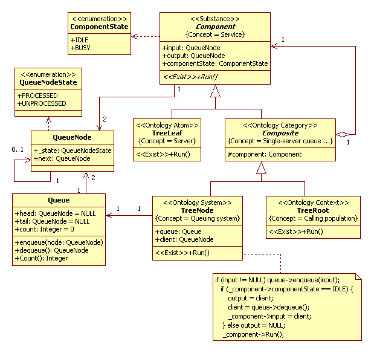
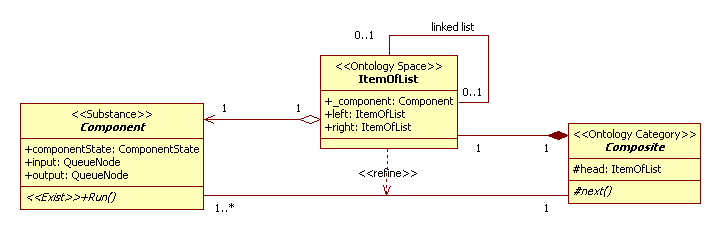
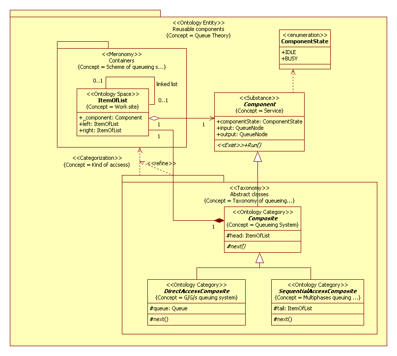
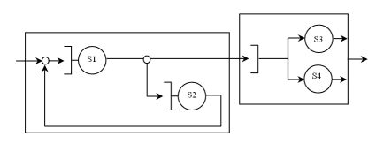
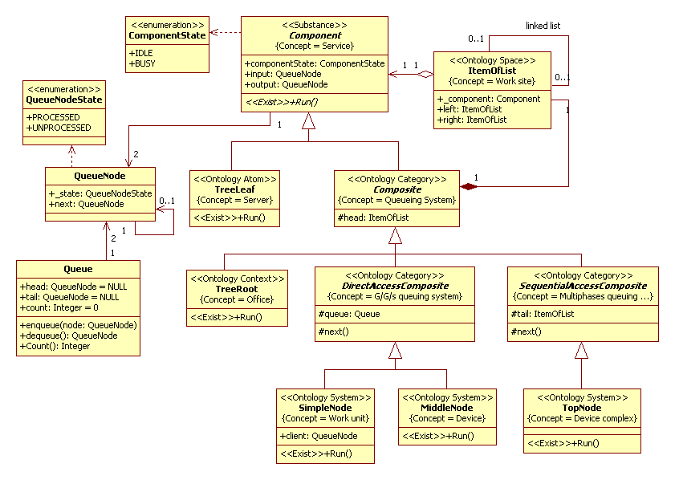
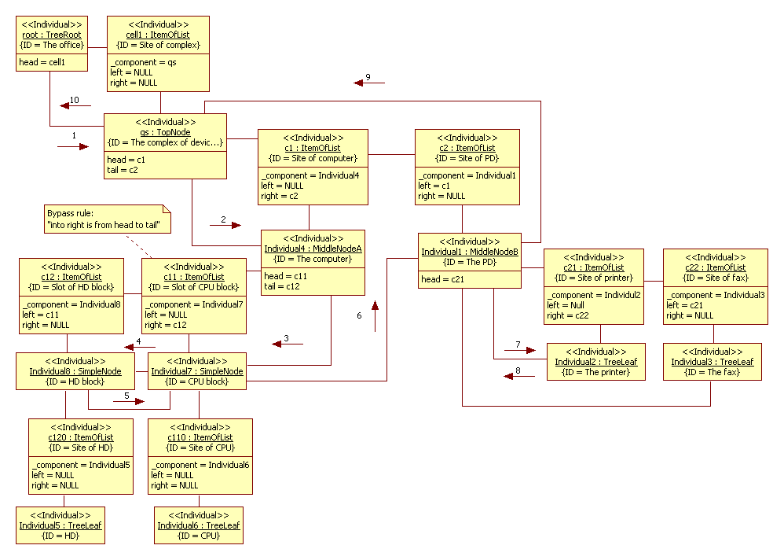

# Queueing theory
[Terms view on Wikipedia](https://en.wikipedia.org/wiki/Queueing_theory)

## 1. M/M/1 Queueing System
The M/M/1 queue is a single server queue with an infinite number of waiting positions where the arrival process is Poisson and the service times are exponentially distributed.
The barber simulation is a classical example of queueing theory.
### Application domain
There is a single-chair barbershop. 
From when it opens in the morning until it closes, customers arrive every 20 ± 10 min at random times. 
If the barber is not busy, he serves a customer immediately; otherwise they must wait in a queue (FIFO order). 
The time needed to serve each customer is 19 ± 5 min also random.<br/> 
It's necessary define an average length of queue and an average time of waiting.

A conceptual model in UML2 SP is an analysis class diagram. This diagram considered as ontology. 
The analysis class diagram of barber model depicted in Fig.1.
<p></p>
Figure 1. 	Analysis class diagram of barber model<br/>

### Description of a computational semantics
The object of TreeNode class and the object of TreeLeaf class interact  according Producer-Consumer pattern [1].
The Producer-Consumer pattern is standard solution for interaction two and more threads. 

### Description of an application domain semantics
The key elements of queueing systems are the customers and servers. The term “customer” can refer to people, 
parts, trucks, e-mails etc. and the term “server” clerks, mechanics, repairmen, CPUs etc. 
Further we shall accurately define these concepts.<br/>
#### Service
The "Component" frame defines **Service** concept (notion). Service is a server or a queuing system. 
Example, customer service in shopping is the provision of service to customers before, during and after a purchase.
The frame has "input" and "output" slots. It is input and output of queuing system. Those attributes has type "QueueNode". 
It is defined of "Customer". The "QueueNode" class isn’t a frame.<br/>
The frame has "componentState" slot. It is state of a queuing entity.<br/>
#### Server
The "TreeLeaf" frame defines **Server** concept. The Run method is realization abstract operation Run. 
This operation defines a rule of change of slots value.<br/>
#### Single-server queueing system
The "Composite" frame defines **Single-server queueing system** concept. The *Ontology Category* stereotype defines a group (category) of a queuing system. In this model it is the single-server queueing system.<br/>
#### Queuing System
The "TreeNode" frame defines **Queuing System** concept. It is main notion in the Queuing Theory. The frame has "Queue" slot. 
It is define "Customer queue" concept. A type of the slot is Queue. The "Queue" class is not a frame. 
The frame has "Client" slot. This slot defines "Client served". 
#### Calling population
The "TreeRoot" frame defines **Calling population** concept. The population of potential customers, referred to 
as the calling population, may be assumed to be finite or infinite. 
It is a boundary and initial condition for the queuing system.
<br/><br/>
### The simulation model in C++ code:  
[baseClassOfBarberProject.h](https://github.com/vgurianov/uml-sp/blob/master/examples/queue/baseClassOfBarberProject.h), [baseClassOfBarberProject.cpp](https://github.com/vgurianov/uml-sp/blob/master/examples/queue/baseClassOfBarberProject.cpp)

## 2. General Queueing Theory in UML2 SP
In general case Component and Composite classes in Fig.1 linked as one to many. For *reification* this link we use ItemOfList class. 
In simple case it is linked list. It is depicted in Fig.2.
<p></p>
Figure 2. The reification<br/>

Usually queueing networks classified as open, closed or mixed network.
However, in UML2 SP a classification is a tool to decomposition queueing network and the classification define elements of decomposition.
First element of decomposition is multiphase queueing network. As instance is Tandem (Open) Queueing Network or a machine shop. This is a special case of a simple open network with N queues where jobs move sequentially from S1 to SN servers 
and then leave the system. It is element describe as SequentialAccessComposite class.
Second element of decomposition is G/G/s queueing system. In this case, element has one queue and N parallel servers. 
Servers work as concurrent threads. This element has store-&-forward node (switch or router). The node route jobs to servers. 
It is element describe as DirectAccessComposite class.
The classification is depicted in Fig.3.
<p></p>
Figure 3. The classification of a queueing system in UML2 SP<br/>

In UML2 SP an architectural diagram is a [conceptual graph](https://en.wikipedia.org/wiki/Conceptual_graph) 
and contains packages and links (dependences) between them. Packages and dependences define concepts.<br/>
Further we shall discuss new frames and new concepts.
#### Queueing theory
The "Reusable components" package defines **Queueing theory** concept. In UML2 SP a theory include base elements of queueing system and classification of systems.
#### Service
Definition of concept as in Fig.1.Service is a server or a queuing system.
#### Server
The "AbstractTreeLeaf" frame defines **Server** concept.This definition of concept is like Fig.1 
but a statistical distribution can be M,D,E, and G for daughters of class.
#### Categorization
Classification of queueing systems is a mapping of elements of "Abstract classes" package to "Containers" package and it is a dependency of packages. For each taxon assign one scheme. It is a functor [2].
#### Scheme of queueing system
The "Containers" package define **Schemes of queueing systems** (similarly Fig.4). In our classification exist one scheme.
#### Work site
The "ItemOfList" frame defines **Work site** concept, i.e. cells to service, and links between them. 
It is a *configuration space* of system. 
#### Taxonomy
The "Abstract classes" package defines **Taxonomy** of queueing systems and consist three abstract classes.
#### Queueing system
Definition of concept as in Fig.1 but class has "next" method for move to members of system.
#### G/G/s queueing system
The "DirectAccessComposite" frame defines **G/G/s queuing system** concept. The frame has "queue" slot. 
It is definition of queue as in Fig.1.
#### Multiphase queuing system
The "SequentialAccessComposite" frame defines **Multiphase queuing system** concept. 
The frame has "tail" slot. It is a result works this system.

A typical example for used this classification are discussed in the subsequent section.

## 3. Example of Decomposition of Queueing System 

### Application domain
In Fig. 4 present a queueing system consist four servers. Server S1 is a CPU, S2 is Hard Disk (HD). 
Both a CPU and HD are parts of computer. Peripheral device (PD) consists at S3 and S4 servers; 
S3 is a printer, S4 is a fax.
<p></p>
Figure 4. 	Example of queueing system

Continuing in the same way, we must define concrete classes for the model.
Model the queueing system is depicted in Fig.5

<p></p>
Figure 5. The Class diagram

### Description of a computational semantics
The objects of daughters of Component class interact  according Producer-Consumer pattern [1]. 
There are ten concurrent threads in total.

### Description of an application domain semantics
The TreeRoot class is model of environment, in our case it is a office. SimpleNode class is G/G/1 queueing system. 
MiddleNode and TopNode classes are levels of decomposition of system.
These classes used to assemble the queueing system from Fig.4. This communication diagram is depicted in Fig.6
<p></p>
Figure 6. The communication diagram

Assemblage the queueing system is
```C++
SimpleNode *s1, *s2;
s1 = new SimpleNode; s2 = new SimpleNode;
// ** Computer
MiddleNodeA *ms = new MiddleNodeA(s1,s2);
// ** Peripheral device
TreeLeaf *s3, *s4;
s3 = new TreeLeaf; s4 = new TreeLeaf;
MiddleNodeB *md = new MiddleNodeB(s3,s4);
// ** Complex
head = new ItemOfList; head->_component = ms;
head->right = new ItemOfList; head->right->_component = md;
head->right->left = head;
tail = head->right;
```

### The simulation model in C++ code:  
[BaseClassesOfTheoryProject.h](https://github.com/vgurianov/uml-sp/blob/master/examples/queue/BaseClassesOfTheoryProject.h), [BaseClassesOfTheoryProject.cpp](https://github.com/vgurianov/uml-sp/blob/master/examples/queue/BaseClassesOfTheoryProject.cpp)

## References
1. Mark Grand, Patterns in Java, Volume 1: A Catalog of Reusable Design Patterns Illustrated with UML, Second Edition, John Wiley & Sons, 2002
2. Shreider Y.A., Sharov A.A. Systems and models. - M: Radio and communication, 1982 - 152 p. (Cybernetics)
More object-oriented models view
3. [Trub I., Trub N. Simulation modeling of computer systems. Training workshop. LAP Lambert Academic Publishing. - 2015. - 135 p.](http://simulation.su/uploads/files/default/2015-uch-praktikum-trub-trub.pdf)(in Russian)
4. Trub I.I. Object-oriented simulation in C ++: Training course - Spb .: Peter, 2006. - 411 p.


