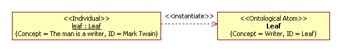

# Conception UML2 SP

A foundation UML2 SP consist a three principles: communicative paradigm, double semantics, and semiotic approach.

**Communicative paradigm.** 
Any object of reality is a communicative process consist a communicative acts. It is an abstraction like a matematical abstration.
We regard the history of object-oriented approach as a history of a discovery of discrete world.

**Double semantics.** Any element of UML2 SP has a dauble semantics: application domain semantics and computinal semantics. An object  is a communicative process and a computinal simulation is communicative process. In simulation a communicative process is general abstration, it is an invariant.

In application domain semantics Analysis Class Diagram is an ontology of application domain. In computinal semantics Analysis Class Diagram is model of program.

**Semiotic approach.** 
The triangle of reference (a semantic triangle) is a triangle: Symbol—Meaning— Thing (a referent). The triangle we consider as a model of stereotype. It is abstract stereotype *AbstractConceptualElement*. The “referent” is a stereotype, the “meaning” is a tagged value of *Concept*, and “symbol” is a tagged value of *ID*. All stereotypes of UML2 SP are children *AbstractConceptualElement* stereotype.
For example, the “author The Adventures of Tom Sawyer” situation  is modeled as

(but if *Concept = Human* for *Leaf* then *Concept = A man is human* and *ID = Samuel Clemens*  for *leaf* object; Mark Twain is the pseudonym Samuel Clemens).

Сlarify this picture:
- UML-element "Class" for object: 
*Concept = A man is writer*, i.e. object is an instance of class. Usually this tagged value hidden on diagram. 
*ID = Mark Twain*, i.e. individual name of object.
- UML-element "Class" for class: 
Tagged value *Concept* is notion, meaning of term.  
Tagged value *ID* is designation of notion. Conveniently designation of notion denotes as name of class then this tagged value can hide on diagram. 
Attributes and operations also define concepts and as rule hidden on diagram, but those elements locate in model.

 

If object or class has SP-stereotype then it is considered as frame by [Marvin Minsky](https://en.wikipedia.org/wiki/Frame_(artificial_intelligence)). Not all classes are frames; most classes are defining of types of slots. Slots define semantics of these classes. A type is a set of value and authorized operations.

