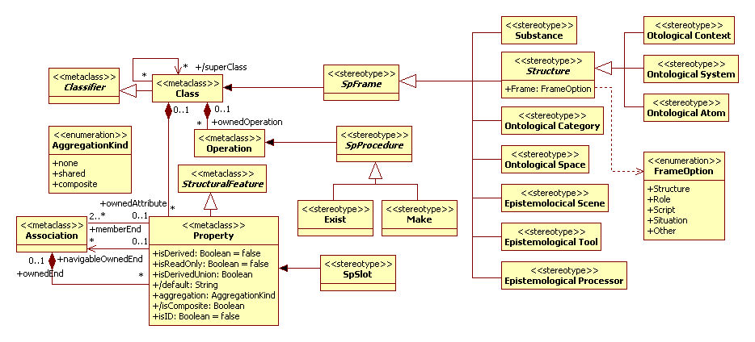
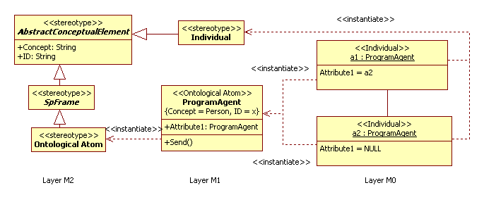

# UML2 Scientific Profile (UML2 SP)
Version 1.0

## 1. Scope
This specification defines the UML2 Scientific Profile (UML2 SP), revision 1.0. The objective of UML is to provide
system architects, software engineers, and software developers with tools for analysis, design, and implementation of
software-based systems as well as for modeling business and similar processes.

## 2. Overview
A general structure profile builds on semiotic approach. It understands of profile as a sign system. A stereotype has attributes named "tagged values". The tagged value assigns a term. Terms reflect the semantics of application domain. The triangle of reference (a semantic triangle) is a triangle: Symbol—Meaning— Thing (a referent). The triangle we consider as a model of stereotype. It is abstract stereotype "AbstractConceptualElement" (see Figure 0). The "referent" is a stereotype, the "meaning" is a tagged value of "Concept", and "symbol" is a tagged value of "ID". All stereotypes of UML2 SP are children for the stereotype. Instance, there is situation the "author The Adventures of Tom Sawyer". A model of the author is an object with "Individual" stereotype. The stereotype has the tagged value of Concept = “A man is Samuel Clemens” and the tagged value of ID = “Mark Twain”.

 
Figure 1: An object-oriented simulation model of a queue to the barber 

According semiotics a sign system has three aspects: syntactics, semantics and pragmatics. We group stereotypes as three packages. It is Semantic Net Elements, Architectural Elements and SP Models.

## 3.	Syntactics of UML SP
The «Semantic Net Elements» package comprises a set of stereotypes which define a semantic net. A semantic net is a main tool to a conceptual modeling in Modeling SP. Concepts of net define as Frames, i.e. semantic net is a frame semantic net. It very like to ontology, but do not is ontology. A definition of Frames and elements of Frame depicted in Figure 3.
 

Figure 2: A definition of stereotypes for Frames 

The diagram defines nine concrete stereotypes for frames and two elements of frame. It is stereotype SPSlot for Slot and stereotype SPProcedure for Attached Procedure. The stereotype «Exist» marks a method for definition of discrete time of model.  In (Guryanov, 2014) suggest detailed arguments for select the set of stereotypes.
In Figure 3 define a stereotype "Individual". This stereotype intended to the objects in role of frame- example. This stereotype used to UseCaseModelRealization into Modeling SP methodology.

 

Figure 3: A definition of stereotypes for an instance of Frame 

Also, the stereotype used in new diagram, named Definition Diagram. It the diagram define concept as instances of Frame. Instance, there is situation the "Don reported its decision to Josh". The example in Figure 4 below shows a "Person" concept definition as Frame and two examples. The "Person" concept (a meaning) we denoted as "x" (a sign), but it can denoted as "Person" word. These diagrams belong to a metamodeling and implicate three layers of UML architecture.

 
Figure 4: Definition Diagram example 

In addition, the package defines elements of Use Case Model (see Figure 5). All stereotypes defined early used only to Analysis Model. Use Case Model is exclusion.

 
Figure 5: A definition of elements of Use Case Model.

## 4.	Semantics of UML SP
The «Architectural Elements» package comprises a set of stereotypes which define semantics of language UML SP. Classes of a class diagram put in a packages. It is definition of semantics these classes or, more precisely, fragments of the class diagram. The stereotypes of «Architectural Elements» are stereotypes for packages (see Figure 6) and stereotypes for dependencies (see Figure 7).

 
Figure 6: A stereotypes for architectural packages 

 
Figure 7: A stereotypes for dependencies of architectural packages 

## 5.	Pragmatics of UML SP
The «SP Models» package comprises a set of stereotypes which define pragmatics of UML SP language. There are three models and two relationships between models (see Figure 8). These models define pragmatics, semantics and syntax of a simulation model.

 
Figure 8: A models definition in UML2 SP 

