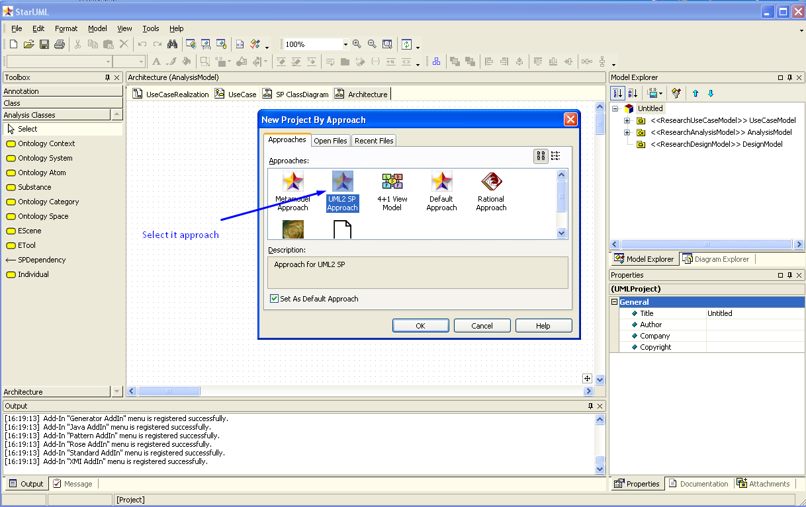
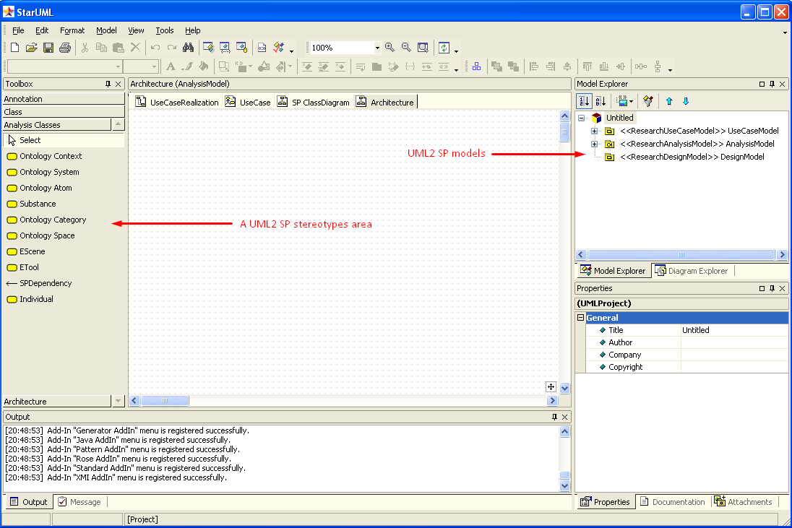
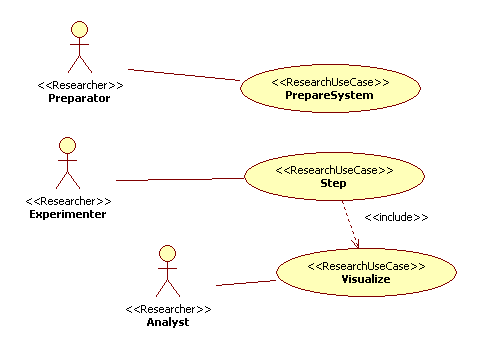
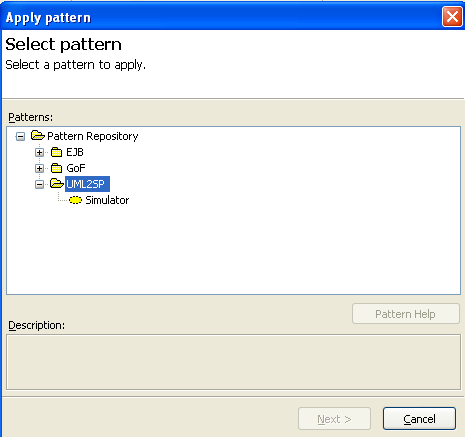
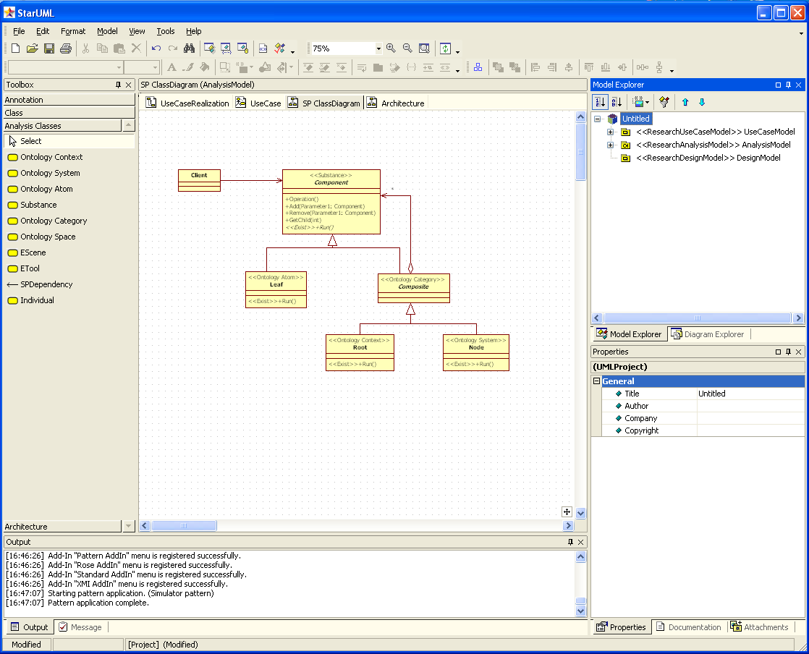
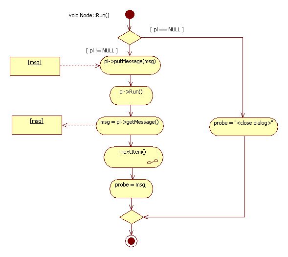

# Introduction
A simulation include next steps:
1. define goals of modeling and requirements to simulator
2. conceptual modeling
3. formal describe
4. programming
5. verification and validation
6. make general plan of experiments
7. make up tactical plan and execute experiment
8. analyze results of experiments

UML2 SP support three first step.

# Simple example
**Application domain**: Greeting  
-- Good morning, Mr. Goldsmith. It’s been a long time since we met. How nice to see you again. 
-- How do you do, Mr. Brown. I’m glad to see you too. How are you? 
-- Not bad, thank you /Thanks, not so well.  
It's necessary create a simulation model of dialog.

# Main steps of development of a simulation model
## 0. Start of development
Run StarUml editor. Apply UML2 SP approach:

and created new project:

 
Save your project.
## 1. Define goals of modeling and requirements to simulator
In UML2 SP this step is a *Requirement* workflow. A Use-Case model is an artefact of *Requirement* workflow.

**Goal:** What will Mr. Brown answer? 
**Plan of experiment:** Observe Mr. Brown and Mr. Goldsmith dialog.  
Go "SP UseCase" tab and draw Use Case diagram . 

A *Use-Case model* define the functional requirements of the simulator: system must do "Prepare","Step" and "Visualize".

## 2. Conceptual modeling
Analysis model is main part of a simulation model. 
In UML2 SP this step is an *Analysis* workflow. An *Analysis model* is an artefact of *Analysis* workflow.  

### 2.1. Apply "Simulation" pattern
Select "SP Class diagram" tab, in main menu select option  "Tool" and next option "Apply Patterns". In new window select folder "UML2SP" and Simulator pattern. 

 
Apply pattern:

### 2.2. Development realisation of use cases 
Go "UseCaseRealization" tab. 
Realization "Step" use case :

  

### 2.3. Development of an Analysis classes
Go "SP Class diagram" tab. 
Class diagram (build from realization):

  

### 2.4. Description application domain semantics

In UML2 SP conceptual model is an [ontology](https://en.wikipedia.org/wiki/Ontology_(information_science)).  Further we use the terms of knowledge engineering. 
You must very good understand  a domain of application.The ontology must be true, otherwise the simulation model will not be correct. 
A [definition](https://en.wikipedia.org/wiki/Dialogue) from Wikipedia:
> "Dialogue (sometimes spelled dialog in U.S. English) is a written or spoken conversational exchange between two or more 
> people, and a literary and theatrical form that depicts such an exchange." 

Formal describe this definition is a ontology depicted in class diagram.  
- The "Component" frame define "Subject" concept. This frame has "name" and "next" slots. 
- The "Leaf" frame  define "Human" concept. 
- The "Composite" frame define "Dialog space" concept and has "pl" slot. 
- The "Root" frame define "Environment" concept . It is initial and boundary conditions. 
- The "Node" frame define "Greeting" concept and has "msg" slot. It is the system under study. 
Class operations define a rule of change of slot. 

### 2.5. Description computational semantics  
The class diagram is variant of a *Composite* pattern . 

## 3. Formal describe
In UML2 SP this step is a *Design* workflow.A *Design model* is an artefact of *Design* workflow.  
An algorithm for the Run operation of the Node class: 

  
On this workflow select a platform and design an algorithms for operations of classes. For Analysis model can be created several Design models. 
# Further - programming, testing and etc.
The simulation model in C++ code: [AppBaseClasses.h](https://github.com/vgurianov/uml-sp/blob/master/examples/SimpleExample/AppBaseClasses.h), [AppBaseClasses.cpp](https://github.com/vgurianov/uml-sp/blob/master/examples/SimpleExample/AppBaseClasses.cpp) 

[See in GitHub](https://github.com/vgurianov/uml-sp/tree/master/examples/SimpleExample) 
