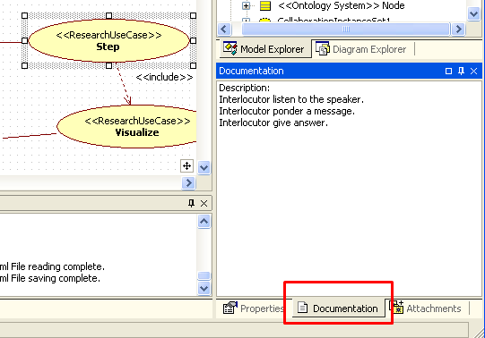

# Introduction
A simulation is a reproduction of behavior a study object, i.e. reproduction of algorithm unless is simplistically say. 
Usually, for simulation use a computer programs.  
The research include followes steps:
1. define aims of modeling and requirements to software of simulation;
2. conceptual modeling;
3. formal describe of software;
4. programming;
5. verification and validation of the simulation model (and program);
6. draw up a general plan of experiments;
7. draw up a tactical plan and execute experiment;
8. analyze results of experiments.

The Unified Process (UP) is a software engineering process (SEP), and it has five workflow are requirements, analysis, design, implementation, and test. The UML2 SP allow to use UP for a development of simulation models. The  requirements, analysis, and design of UP support three first step of a simulation.

# Simple example
In this example we shall simulated dialogs between humans.<br/>
**Application domain**: Greeting <br/>
-- Good morning, Mr. Goldsmith. It’s been a long time since we met. How nice to see you again.<br/>
-- How do you do, Mr. Brown. I’m glad to see you too. How are you?<br/>
-- Not bad, thank you /Thanks, not so well.<br/><br/>
It's necessary create a simulation model of dialog.

# Main steps of development of a simulation model
## 0. Start of development
Run StarUML editor. Apply UML2 SP approach (Fig.1):
<p></p>
Figure 1. A selection of approach<br/>

or created new project. Main work areas see Fig.2.
<p></p>
Figure 2. StarUML main window for UML2 SP approach

Save your project.
## 1. Determination of modeling objectives and requirements to software of simulation
In UML2 SP this step is a *Requirement* workflow. A Use-Case model is an artefact of *Requirement* workflow.<br/>

**Objective:** What will Mr. Brown answer?<br/>
**Plan of experiment:** Observe Mr. Brown and Mr. Goldsmith dialog.<br/><br/>
Go "UseCase" tab and draw Use Case diagram (Fig.3).<br>
<p></p>
Figure 3. Use-Case Diagram<br/>

A *Use-Case model* define the functional requirements of the software of simulation: system must do "Prepare","Step" and "Visualize".<br/>

Use-case must be accurately describe. A main use-case is "Step" use-case.<br/> 
**Description:** Interlocutor listen to the speaker. Interlocutor ponder a message. Interlocutor give answer.<br/>
The description should be placed in the model, see Fig.4.
<p></p>
Figure 4. Description into Use-Case Model<br/>
We recommend use a semi-formal description, i.e. specification of use-case (see *UML2 SP Application guide*).

## 2. Conceptual modeling
In UML2 SP this step is an *Analysis* workflow. An *Analysis model* is an artefact of *Analysis* workflow.<br/>
In modern science, description of a model is mathematical description. The UML2 SP provide alternative posible of model description. It is very much useful of whenever a mathematical model do not be exist.<br/>
For description of model use an ontology. An ontology is a rigorous language like matematics language. In UML2 SP, an ontology is depicted as a class diagram. Application domain semantics is appointed of  "Concept" tagget value. In matematical text, it is "where" word.<br/>
We draw an analogy with mathematics. The class diagram is similar a differencial equation, a communicative  diagram is similar a particular solution, and sequence diagram is similar a graph of function. We understend "similar" as "same role" to description of model.<br/>
So, our end aim is to create Analysis Class Diagram.<br/>

### 2.1. Apply "Simulator" pattern
Select "ClassDiagram" tab, in main menu select option  "Tool" and next option "Apply Patterns". In new window select folder "UML2SP" and Simulator pattern.<br/>
<p></p>
Figure 5. "Apply Patterns" window<br/>
Apply pattern:
<p></p>
Figure 6. Applying "Simulator" pattern
### 2.2. Development realisation of use cases
In first step, we write use-case realization on a pseudo-code:
```
Node() {
	pl = new Leaf("Goldsmith");
	pl->next = new Leaf("Brown");
	msg="";
}

void Run() { // <<Exist>>
if (pl != NULL) {
	pl->putMessage(msg);      // Interlocutor listen to the speaker
	pl->Run();                // Interlocutor ponder a message
	msg = pl->getMessage();   // Interlocutor give answer
	probe = msg; // measurement
this->nextItem();
} else probe = "<close dialog>";
}
```
In second step, we draw Communication (or Sequence) Diagram (see Fig.7).<br/>
Go "UseCaseRealization" tab. Realization "Step" use case :
<p></p> <br/>
Figure 7. A Communication Diagram for simulation of dialog

### 2.3. Development of an Analysis classes
A class diagram build from communication diagram. This is non-formal procedure. The communication diagram must be an instance of class diagram: object is instance of class, link is instance of association. In this example it is just (Fig.8).<br/>

Go "SP Class diagram" tab. Class diagram:
<p></p> <br/>
Figure 8. An Analysis Class Diagram for the simulation

For the class diagram must assign computational semantics and application domain semantics.
### 2.4. Description of a computational semantics<br> 
The class diagram is variant of a *Composite* pattern . Threads interact according to the rules like in nature. In this case is *Single Threaded Execution* pattern<br/>

### 2.5. Description of an application domain semantics

In UML2 SP conceptual model is an [ontology](https://en.wikipedia.org/wiki/Ontology_(information_science)).  Further we use the terms of [Ontology engineering](https://en.wikipedia.org/wiki/Ontology_engineering) in [notation by Marvin Minsky](https://en.wikipedia.org/wiki/Frame_(artificial_intelligence)). You must very good understand  a domain of application.The ontology must be true, otherwise the simulation model will not be correct.<br>

A [definition of dialog](https://en.wikipedia.org/wiki/Dialogue) from Wikipedia:
> "Dialogue (sometimes spelled dialog in U.S. English) is a written or spoken conversational exchange between two or more 
> people, and a literary and theatrical form that depicts such an exchange."<br>

Formal describe this definition is a ontology depicted in class diagram.<br> 
- The "Component" frame define "Subject" concept. This frame has "name" and "next" slots.<br>
- The "Leaf" frame  define "Human" concept.<br>
- The "Composite" frame define "Dialog space" concept and has "pl" slot.<br>
- The "Root" frame define "Environment" concept . It is initial and boundary conditions.<br>
- The "Node" frame define "Greeting" concept and has "msg" slot. It is the system under study.<br>
Class operations define a rule of change of slot.<br><br>
An ontology is main artefact in the UML2 SP.


## 3. Formal describe
In UML2 SP this step is a *Design* workflow.A *Design model* is an artefact of *Design* workflow.<br><br/>
An algorithm for the Run operation of the Node class:<br>
<p></p> <br>
On this workflow select a platform and design an algorithms for operations of classes. For Analysis model can be created several Design models.<br>
# Further - programming, testing and etc.
The simulation model in C++ code: [AppBaseClasses.h](https://github.com/vgurianov/uml-sp/blob/master/examples/SimpleExample/AppBaseClasses.h), [AppBaseClasses.cpp](https://github.com/vgurianov/uml-sp/blob/master/examples/SimpleExample/AppBaseClasses.cpp)<br>

[View on GitHub](https://github.com/vgurianov/uml-sp/tree/master/examples/SimpleExample) 
