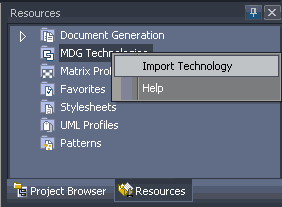
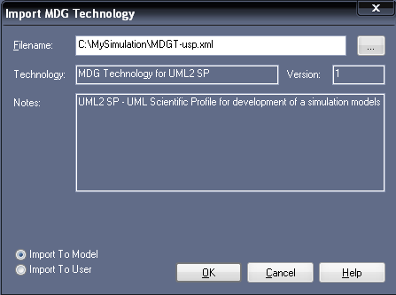
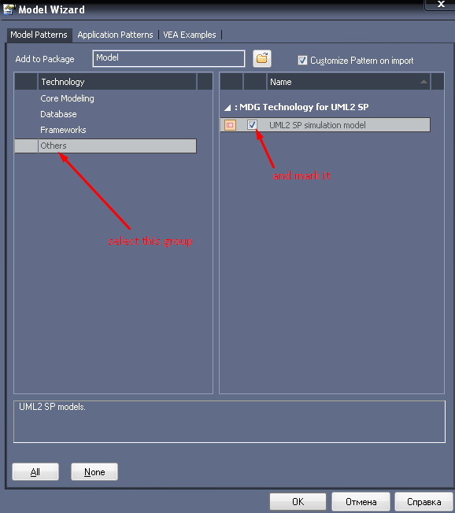
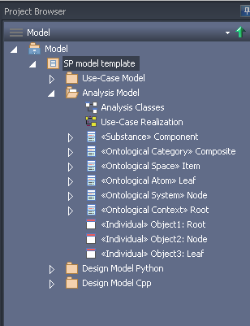
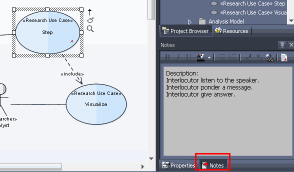
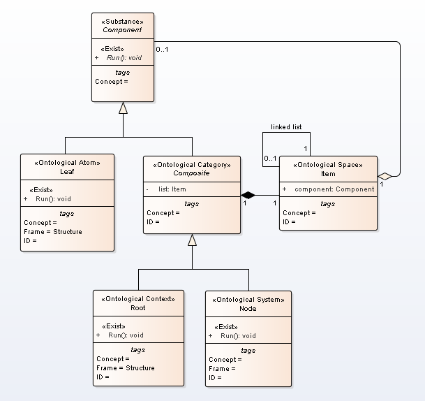
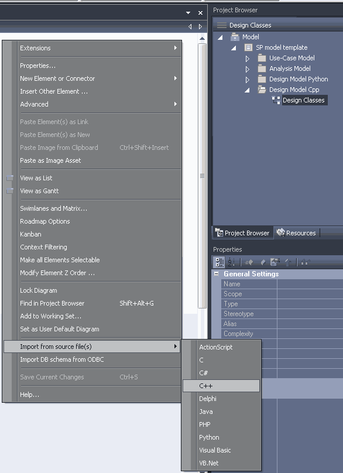
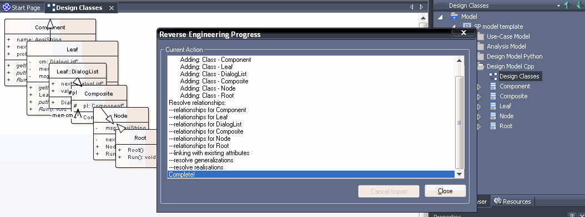

# Introduction
A simulation is a reproduction of behavior a study object, i.e. reproduction of algorithm unless is simplistically say. 
Usually, for simulation use a computer programs.  
The research include followes steps:
1. define aims of modeling and requirements to software of simulation;
2. conceptual modeling;
3. formal describe of software;
4. programming;
5. verification and validation of the simulation model (and program);
6. draw up a general plan of experiments;
7. draw up a tactical plan and execute experiment;
8. analyze results of experiments.

The [Unified Process (UP)](https://en.wikipedia.org/wiki/Unified_Process) is a software engineering process (SEP), and it has five workflow are requirements, analysis, design, implementation, and test. The UML2 SP allow to use UP for a development of simulation models. The  requirements, analysis, and design of UP support three first step of a simulation.

# Simple example
In this example we shall simulated dialogs between humans.<br/>
**Problem domain**: Greeting <br/>
-- Good morning, Mr. Goldsmith. It’s been a long time since we met. How nice to see you again.<br/>
-- How do you do, Mr. Brown. I’m glad to see you too. How are you?<br/>
-- Not bad, thank you /Thanks, not so well.<br/><br/>
It's necessary create a simulation model of dialog.

# Main steps of development of a simulation model
UML2 SP ver. 1.0

## 0. Start of development
Download [Sparx Systems Enterprise Architect](http://www.sparxsystems.com/products/ea/trial/request.html), Trial 30 days, and install it.<br/>
Download [UML2 SP for EA](ea/MySimulation.rar) and extract, for example, to C:\MySimulation\.<br/>

Run Enterprise Architect editor. 
- Created new project (select Cancel for model template if it's necessary). Enterprise Architect will create a new empty model for you to begin working with;
<p></p>
Figure 1. The new empty model is created<br/>
- Go the Resources;
- Right-click to the 'MDG Technology' and select 'Import Technology' option:
<p></p>
Figure 2. The 'Import Technology' selection<br/>
- Select file with the MTS-USP (UML2_SP.xml);
<p></p>
Figure 3. The file selection<br/>
- Go the Project Browser, right-click to 'Model' package, and select 'Add', and 'Add a Model using Wizard' (Fig.3)
<p></p>
Figure 4. The 'Model Wizard' selection<br/>
- Select the 'Others group' and the 'UML2 SP simulation model' option
<p></p>
Figure 5. The 'UML2 SP simulation model' selection<br/><br/>
The Model Wizard automatically creates a new UML2 SP model.
<p></p>
Figure 6. The UML2 SP simulation model template<br/><br/>
Main work areas see on Fig.7.
<p></p>
Figure 7. Main window for UML2 SP simulation model

Save your project, for instance as My Simulation Model.

## 1. Determination of modeling objectives and requirements to software of simulation
In UML2 SP this step is a *Requirement* workflow. A Use-Case model is an artefact of *Requirement* workflow.<br/>

**Objective:** What will Mr. Brown answer?<br/>
**Plan of experiment:** Observe Mr. Brown and Mr. Goldsmith dialog.<br/><br/>
Go the "Use-Case Model" package and draw Use Case diagram (Fig.8). The "Use-Case Model" package has Use-Case diagram template.<br>
<p></p>
Figure 8. Use-Case Diagram<br/>

A *Use-Case model* define the functional requirements of the software of simulation: system must do "Prepare","Step" and "Visualize".<br/>

Use-case must be accurately describe. A main use-case is "Step" use-case.<br/> 
**Description:** Interlocutor listen to the speaker. Interlocutor ponder a message. Interlocutor give answer.<br/>
The description should be placed in the model, see Fig.9.
<p></p>
Figure 9. Description into Use-Case Model<br/>
We recommend use a semi-formal description, i.e. specification of use-case (see *UML2 SP Application guide*).

## 2. Conceptual modeling
In UML2 SP this step is an *Analysis* workflow. An *Analysis model* is an artefact of *Analysis* workflow.<br/>
In modern science, description of a model is mathematical description. The UML2 SP provide alternative posible of model description. It is very much useful of whenever a mathematical model do not be exist.<br/>
For description of model use an ontology. An ontology is a rigorous language like matematics language. In UML2 SP, an ontology is depicted as a class diagram. Application domain semantics is appointed of  "Concept" tagget value. In matematical text, it is "where" word.<br/>
We draw an analogy with mathematics. The class diagram is similar a differencial equation, a communicative  diagram is similar a particular solution, and sequence diagram is similar a graph of function.<br/>
So, our end aim is to create Analysis Class Diagram.<br/>

### 2.1. 'Analysis Model' package
Select 'Analysis Model' package. This package consist 'Analysis classes' diagram and 'Use-Case Realization' diagram.<br/>
<p></p>
Figure 10. 'Analysis Model' package<br/>
The 'Use-Case Realization' diagram is communication diagram. The 'Analysis class' diagram contain 'Simulator' pattern:
<p></p>
Figure 11. 'Simulator' pattern<br/>
The 'Simulator' pattern is 'Composite' pattern from the GoF.

### 2.2. Development realisation of use cases
In first step, we write use-case realization on a pseudo-code:
```
Node() {
	pl = new Leaf("Goldsmith");
	pl->next = new Leaf("Brown");
	msg="";
}

void Run() { // <<Exist>>
if (pl != NULL) {
	pl->putMessage(msg);      // Interlocutor listen to the speaker
	pl->Run();                // Interlocutor ponder a message
	msg = pl->getMessage();   // Interlocutor give answer
	probe = msg; // measurement
this->nextItem();
} else probe = "<close dialog>";
}
```
In second step, we draw Communication (or Sequence) Diagram (see Fig.7).<br/>
Go the 'UseCaseRealization' diagram. Realization "Step" use case :
<p></p> <br/>
Figure 12. A Communication Diagram for simulation of dialog

### 2.3. Development of an Analysis classes
A class diagram build from communication diagram. This is non-formal procedure. The communication diagram must be an instance of class diagram: object is instance of class, link is instance of association. In this example it is just.<br/>

Go the 'Analysis classes' diagram. In our case, a configuration space is degenerate and we delete 'Item' element. Class diagram is:
<p></p> <br/>
Figure 13. An Analysis Class Diagram for the simulation

For the class diagram must assign computational semantics and application domain semantics.
### 2.4. Description of a computational semantics<br> 
The class diagram is variant of a *Composite* pattern . Threads interact according to the rules like in nature. In this case is *Single Threaded Execution* pattern<br/>

### 2.5. Description of a problem domain semantics

In UML2 SP, conceptual model is an [ontology](https://en.wikipedia.org/wiki/Ontology_(information_science)).  Further we use the terms of [Ontology engineering](https://en.wikipedia.org/wiki/Ontology_engineering) in [notation by Marvin Minsky](https://en.wikipedia.org/wiki/Frame_(artificial_intelligence)). You must very good understand  a domain of application.The ontology must be true, otherwise the simulation model will not be correct.<br>

A [definition of dialog](https://en.wikipedia.org/wiki/Dialogue) from Wikipedia:
> "Dialogue (sometimes spelled dialog in U.S. English) is a written or spoken conversational exchange between two or more 
> people, and a literary and theatrical form that depicts such an exchange."<br>

Formal describe this definition is a ontology depicted in class diagram.<br> 
- The "Component" frame define "Subject" concept. This frame has "name" and "next" slots.<br>
- The "Leaf" frame  define "Human" concept.<br>
- The "Composite" frame define "Dialog space" concept and has "pl" slot.<br>
- The "Root" frame define "Environment" concept . It is initial and boundary conditions.<br>
- The "Node" frame define "Greeting" concept and has "msg" slot. It is the system under study.<br>
Class operations define a rule of change of slot.<br>

An ontology is main artefact in the UML2 SP.


## 3. Formal description of software
In UML2 SP, this step is a *Design* workflow. A *Design model* is an artefact of *Design* workflow.<br>

In this workflow, we select a platform, programming language, and design of algorithms for operations of classes. The design of the communication process in Fig. 12 depends on the programming language. For Analysis model can be created several Design models for different programming language.<br/>
This workflow requires a lot of time.<br/>
It can be said that the Design Model should provide synchronization between the Analysis Model and the program code. <br>

In our case, we select C++ and parallel programming (but not concurrent programming).<br> 
So, end step execute in hand mode. Let the code be prepared.<br>
(a) Connect with the C ++ code
<p></p>
Figure 14. Import classes from C++ code <br/>

(b) Execute reverse engineering
<p></p>
Figure 15. Run reverse engineering <br/>

(c) Compare class diagrams
<p></p>
Figure 16. Class diagram of Design Model <br/>

It is necessary to make sure that the diagram of the analysis classes coincides with the diagram of the design classes. Otherwise, make changes to the program code.<br/>
Model drive a development of software.

# Further - programming, testing and etc.
The simulation model in C++ code: [AppBaseClasses.h](https://github.com/vgurianov/uml-sp/blob/master/examples/SimpleExample/AppBaseClasses.h), [AppBaseClasses.cpp](https://github.com/vgurianov/uml-sp/blob/master/examples/SimpleExample/AppBaseClasses.cpp)<br>
The simulation model in Python code: [example.py](https://github.com/vgurianov/uml-sp/blob/master/examples/SimpleExample/example.py).
